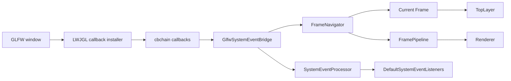

# LWJGL Application Host Navigation and Top Layer

## Document Context

- Status: Approved
- Dependencies: E2/M3
- Parent: [E2 - Frame runtime integration](../work/E2%20-%20Frame%20runtime%20integration.md)
- Children: None
- Related: [E2/M4 - Add navigable LWJGL application host](../work/E2/M4%20-%20Add%20navigable%20LWJGL%20application%20host.md)
- Next: [E2/M4/P1 - Compose navigation and top-layer host](../work/E2/M4/P1%20-%20Compose%20navigation%20and%20top-layer%20host.md)

## Goal

Provide a production LWJGL application host that reuses the standard system-event listeners,
coexists with other GLFW callback consumers through cbchain, targets the active navigated `Frame`,
and implements browser-like modal behavior without treating modals as frames.

## Non-Goals

- Replacing manual host composition or making the new host mandatory.
- Moving window, renderer, or GLFW lifecycle ownership into backend-neutral core services.
- Rendering inactive navigation-history frames underneath the current frame.
- Implementing popovers, fullscreen promotion, arbitrary overlay portals, or retained rendering.
- Creating a new module before an independently required second host proves that boundary necessary.

## Current Context and Constraints

- `LwjglFrameServices` already composes a standard `SystemEventListenerProviderImpl`, but the
  composition is private and tied to one convenience-service instance.
- `DefaultLwjglWindow` already implements `LwjglWindow`, creates a standalone GLFW/OpenGL window,
  maps GLFW values into `SystemEvent` instances, and targets one constructor-bound `Frame`.
- `NvgLwjglApplication` and `AbstractLwjglApplication` provide the reusable single-frame loop.
- `DefaultLwjglWindow` installs callbacks directly with `glfwSet*Callback`, owns global GLFW
  initialization and termination, and frees all callbacks for its window. This is appropriate for a
  standalone owner but not sufficient for callback coexistence in an embedded host.
- The `spinygui` facade module already aggregates core, LWJGL/NanoVG, and cbchain dependencies and is
  therefore the smallest existing module that can own the high-level composition.
- `Frame` must not own host services, the host loop, or GLFW resources.

## Approved Architecture

### Navigation

`FrameNavigator` owns one non-null current frame and browser-like navigation history:

- `navigate` makes a new frame current, records the previous frame in back history, and clears
  forward history.
- `back` and `forward` switch the current frame when history is available.
- Only the current frame is prepared, rendered, and targeted by newly captured system events.
- Inactive history frames may remain reachable through the navigator but are not rendered or treated
  as modal layers.

Navigation is a host concern. It must not add service or renderer references to `Frame`.

### Modal top layer

Each active `Frame` owns a `TopLayer` containing an ordered LIFO set of modal element roots:

- The normal frame tree remains visible.
- Rendering order is normal content, modal backdrop, then modal content in top-layer order.
- While a modal exists, normal content is inert for pointer, keyboard, and focus targeting.
- Only the topmost modal receives interactive targeting; closing it restores the previous modal or
  the normal frame as the interactive surface.
- Top-layer mutations participate in normal frame invalidation and source-revision rules.

The first implementation supports modal entries only. The `TopLayer` name records the rendering and
interaction boundary without authorizing speculative popover or fullscreen APIs.

### GLFW event bridge

`GlfwSystemEventBridge` owns GLFW-to-`SystemEvent` mapping and cbchain callback participation:

- It resolves the target through `FrameNavigator.currentFrame()` when a callback captures an event.
- It pushes typed events to the configured `SystemEventProcessor` without processing them inline.
- It may install host-owned callback chains for a standalone window or attach handlers to
  caller-provided chains for an embedded window.
- It releases only callbacks or chain registrations that it owns; it must not free unrelated host
  callbacks or terminate GLFW.
- Escape-to-close remains an explicit host policy rather than an implicit event-mapping rule.

The LWJGL backend exposes a narrow callback-installation strategy accepted by `DefaultLwjglWindow`.
The facade's cbchain-aware bridge implements that strategy. This keeps the backend independent of
the facade while allowing the standalone window to reuse the same event mapping. Existing
constructors retain a backend-owned compatibility strategy.

### Standard listeners and host composition

`DefaultSystemEventListeners` exposes the standard listener-provider composition currently private
to `LwjglFrameServices`. `LwjglApplicationHost` composes:

- `LwjglWindow`;
- `GlfwSystemEventBridge`;
- `FrameNavigator`;
- `DefaultSystemEventListeners` and the existing frame services;
- `FramePipeline`; and
- `Renderer`.

The existing single-frame constructors remain supported through a navigator containing one frame.
Low-level users may continue to inject their own window, callbacks, listeners, services, pipeline,
and renderer.

## Ownership and Data Flow

## Compatibility Behavior

- Existing `AbstractLwjglApplication`, `NvgLwjglApplication`, `LwjglFrameServices`, and
  `DefaultLwjglWindow` entry points remain source-compatible unless a concrete defect requires a
  separately reviewed migration.
- The current standalone window may continue owning GLFW initialization and termination.
- Embedded integrations can use the event bridge and caller-provided callback chains without using
  the standalone window owner.
- Event ordering remains `poll -> input -> update -> size sync -> prepare -> render -> swap`.

## Risks and Mitigations

- **Stale event targets after navigation:** resolve the frame when the callback captures the event,
  process navigation changes between input batches, and test navigation during host update.
- **Modal input leakage:** centralize top-layer-aware hit testing and focus admission rather than
  adding listener-specific modal checks.
- **Callback ownership violations:** distinguish owned chains from injected chains and test exact
  detach/close behavior without requiring a native window.
- **Global GLFW interference:** keep GLFW initialization/termination in the standalone window owner;
  the bridge never owns global GLFW lifecycle.
- **Facade-module overreach:** keep backend-neutral contracts in core and place only the cbchain-aware
  high-level composition in the existing `spinygui` facade module.

## Validation Strategy

- Deterministic tests for navigation history, current-frame preparation, and event capture targeting.
- Core tests for modal paint order, inert background behavior, topmost hit testing, focus restoration,
  invalidation, and nested modal close order.
- Callback-registration tests using fakes or injected chains, including coexistence and exact
  ownership-aware teardown.
- Host lifecycle tests proving the canonical frame order and reverse cleanup order across navigation.
- Existing single-frame application and manual demo tests remain green.
- A native smoke check verifies callback delivery, navigation, modal focus, and close behavior; it is
  reported separately from automated evidence.
