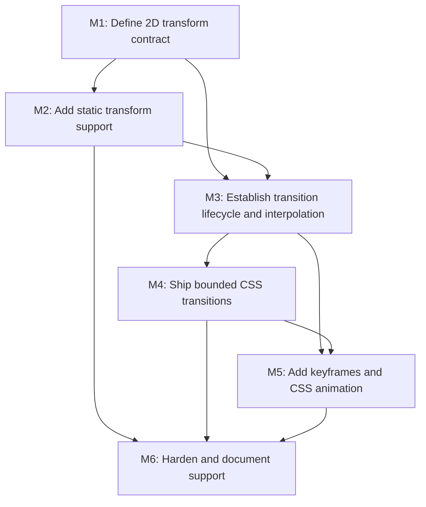

# CSS Transform, Transition, and Animation Support Plan

## Goal

Add a bounded CSS motion system to SpinyGUI. The first usable slice supports 2D `transform` and CSS `transition`; it then grows into `@keyframes` animations on the same timeline and interpolation model. Animated values must be visible in NanoVG rendering and remain coherent with clipping, scrolling, layout-derived geometry, and pointer hit-testing.

## Non-Goals

- 3D transforms, `perspective`, `transform-style`, or `backface-visibility`.
- CSS Motion Path, scroll-driven animations, Web Animations API, and CSS custom-property animation.
- Layout-affecting transition properties in the first transition release (`width`, `height`, margins, padding, flex/grid properties, and position offsets).
- Browser-level compositing, stacking-context parity, or a second rendering backend.
- Changing normal style cascade, layout algorithms, or event semantics except where transform-aware coordinates require it.

## Context

- `docs/features/css-properties-support.md` currently classifies both transforms and transitions as XL work; this plan intentionally treats them as one shared subsystem rather than independent property additions.
- `StyleManagerImpl.recalculate(Frame)` recomputes and overwrites each element's `ResolvedStyle`; it does not retain previous computed values or emit style-change information for a transition runner.
- `AnimatorImpl` and `TimeService` already provide a generic frame-time loop, but no production path invokes it and it has no CSS ownership, cancellation, or invalidation contract.
- `NvgRenderer` paints `layoutChildNodes()` directly and current hit-testing depends on layout-derived geometry. A transform cannot be renderer-only: clipped descendants, scroll offsets, debug rendering, and pointer coordinate conversion must use the same transform model.
- The CSS parser grammar already contains keyframe productions, while `AtRuleVisitor` currently materializes only `@font-face`; `@keyframes` therefore needs an explicit stylesheet model and visitor path.

## Implementation Document Hierarchy

The implementation-ready dependency graph is under [`docs/work/E1 - CSS animation support.md`](../work/E1%20-%20CSS%20animation%20support.md). Each milestone has a separate document under `docs/work/E1/`, and every phase contains independently reviewable `T<N>` task nodes with acceptance checks.

## Milestones

### M1: Define the 2D transform contract and render-coordinate boundary

**Purpose:** Establish one immutable, testable 2D transform model before parser or animation work depends on it.

**Depends on:** None.
**Enables:** M2, M3.
**Parallelizable with:** None.

**Architectural Proposition:** Keep CSS transform values in core style types, resolve them into a per-node render transform after layout, and apply the same matrix stack in NanoVG painting and inverse mapping during hit-testing. Layout boxes remain untransformed for the first release; rendering and input use a distinct visual-coordinate layer.

**Key Work:**

- Define the supported first-release grammar: `none`, `translate`, `translateX`, `translateY`, `scale`, `scaleX`, `scaleY`, and `rotate`; reject matrix, skew, 3D, and unsupported mixed units rather than silently dropping terms.
- Decide and document transform-list multiplication order, transform-origin semantics, percent-reference box, and the default origin. The recommended scope is a 2D origin resolved against the border box, with `%` translation resolved against that same box.
- Introduce a small affine-matrix/value API that can compose, invert, and report non-invertible transforms without leaking NanoVG types into `spinygui.core`.
- Define a node-level visual/render state owned outside `ResolvedStyle` so the computed CSS target remains distinct from the animated current value.
- Map clipping and scroll boundaries through the same transform stack; determine whether debug overlay output is rendered before or after node transforms and lock the choice in tests.
- Add core tests for composition order, origin translation, percentage resolution, inverse mapping, and non-invertible-scale behavior.

**Open Questions:**

- Whether transformed elements establish a local containing block for absolute descendants is deferred. The first release should transform descendants visually as a subtree but retain existing layout containing-block rules.
- Whether z-index sorting needs a transform-created stacking context is deferred; preserve existing z-index order until a concrete overlap case requires a separate stacking-context model.

**Validation:**

- Matrix and coordinate tests establish exact expected points for every supported transform function and composition order.
- A written boundary decision identifies which geometry remains layout-space and which is visual-space.

### M2: Add `transform` parsing, resolved style, NanoVG rendering, and hit testing

**Purpose:** Deliver usable static 2D transforms before transitions animate them.

**Depends on:** M1.
**Enables:** M3, M4, M6.
**Parallelizable with:** None.

**Architectural Proposition:** Add a dedicated `TransformPropertyProvider` and typed `ResolvedStyle` accessors. The renderer owns NanoVG save/restore and matrix application; core owns transform resolution and hit-test coordinate conversion so all renderers can implement the same contract later.

**Key Work:**

- Register `transform` and `transform-origin` in `Properties`, the default property store, CSS validation, and `ResolvedStyle`, with CSS defaults of `none` and `50% 50%`.
- Reuse `TermFunction`/`TermList` only where they retain transform-function boundaries; add semantic parser support if the current visitor loses units or function grouping.
- Resolve transforms after layout size is known, so percentage translations and origins are correct, without modifying layout dimensions, scroll metrics, or normal-flow placement.
- Apply and restore the affine transform around every element subtree in `NvgRenderer`; ensure element background/border, text, input/textarea, scrollbars, and descendants share it.
- Make clipping, scroll translation, and debug geometry compose in a documented order, then adapt event target selection to inverse-transform pointer coordinates per ancestor.
- Add focused style, layout/hit-test, and NanoVG recording tests, plus a complex demo example using translate, scale, and rotate.

**Open Questions:** None after M1 decisions are accepted.

**Validation:**

- A static transform visibly moves, scales, and rotates an element and its descendants without changing its layout box.
- Pointer events hit the transformed visual target and do not hit the former untransformed-only location.
- Nested transforms, overflow clipping, and a transformed child of a scroll container pass focused regression tests.

### M3: Establish CSS transition lifecycle, timing, and interpolation contracts

**Purpose:** Turn a change in computed style into deterministic per-property animations without letting animations mutate the CSS cascade.

**Depends on:** M1, M2.
**Enables:** M4, M5.
**Parallelizable with:** None.

**Architectural Proposition:** On each style recomputation, compare the new computed target with the prior target, create or retarget property animations from the current presented value, and write results only to node visual state. A frame scheduler invokes the animator before layout/render; completed or replaced animations cleanly detach.

**Key Work:**

- Define typed models and property-provider parsing for `transition-property`, `transition-duration`, `transition-delay`, `transition-timing-function`, and the `transition` shorthand; support `none`, `all`, named supported properties, comma-separated lists, `linear`, `ease`, `ease-in`, `ease-out`, `ease-in-out`, and `cubic-bezier(...)`.
- Add an animation coordinator that owns the existing `Animator` lifecycle, first-frame time initialization, cancellation, retargeting, delays, and frame invalidation; fix or wrap the generic animator only where its lifecycle prevents these guarantees.
- Extend style recalculation to preserve previous computed targets per element and notify the coordinator only after a successful new cascade result. Inline-style changes and pseudo-class-driven recalculation must use the same path.
- Define a closed interpolation registry. The initial transitionable set is `opacity`, `background-color`, border colors, `color`, `box-shadow` only if its existing value model supports compatible interpolation, and `transform`; discrete values and all layout-affecting properties change immediately.
- Define behavior for missing/extra list entries, zero duration, negative/invalid values, repeated changes mid-transition, element removal, `display:none`, and non-interpolable value pairs.
- Add deterministic `TimeService`-driven unit tests for timing, easing, delay, cancellation, retargeting, and style-change detection.

**Open Questions:**

- Is an explicit application/frame scheduler available outside demos? If not, M3 must expose a small public per-frame update boundary rather than coupling CSS animation to `NvgRenderer`.

**Validation:**

- A style target change starts exactly one transition with the declared delay, duration, and easing.
- A second change during the transition starts from the current presented value, not the stale original target.
- Unsupported and layout-affecting properties do not create an animation and still resolve to their normal final values.

### M4: Ship the bounded `transition` feature slice

**Purpose:** Make transitions usable in real CSS and prove the complete style-to-frame-to-render path.

**Depends on:** M3.
**Enables:** M5, M6.
**Parallelizable with:** None.

**Architectural Proposition:** Treat transitions as presentation overlays on computed style. Rendering reads presented values, while layout continues to read computed values until a later, separately planned layout-animation feature exists.

**Key Work:**

- Route presented values to the NanoVG element, border, text, input, textarea, and scrollbar renderers for the approved property set, with `transform` routed through the M2 matrix boundary.
- Add hover/focus or programmatic inline-style transition demonstrations without making a demo the only proof of behavior.
- Add regressions for transition behavior alongside scroll clipping, nested transforms, input focus/caret paint, and scrollbar paint.
- Update `css-properties-support.md` only for the transition longhands and animated property subset actually delivered; document unsupported transition targets explicitly.

**Open Questions:** None.

**Validation:**

- The complex demo visibly transitions opacity/color/transform after a real style change.
- Focused core and NanoVG tests prove intermediate and final rendered values.
- Existing block, flex, inline-block, overflow, input, textarea, and renderer test suites remain green.

### M5: Add `@keyframes` and CSS `animation` on the shared timeline

**Purpose:** Extend the verified transition infrastructure to declarative multi-stop animation without creating a second scheduler or interpolation path.

**Depends on:** M3, M4.
**Enables:** M6.
**Parallelizable with:** None.

**Architectural Proposition:** Parse `@keyframes` into typed stylesheet at-rules, resolve `animation-name` references against the active stylesheets, and compile each active animation into the same property tracks and presentation overlay used by transitions. Keyframes win over transitions for the same presented property according to a documented, bounded precedence rule.

**Key Work:**

- Implement a `KeyframesRule` model and complete the existing parser visitor route, including named blocks and `from`/`to`/percentage selectors; reject malformed or unsupported declarations explicitly.
- Add `animation-name`, `animation-duration`, `animation-delay`, `animation-timing-function`, `animation-iteration-count`, `animation-direction`, `animation-fill-mode`, `animation-play-state`, and `animation` shorthand parsing and validation.
- Support an initial subset: finite and `infinite` iterations, normal/reverse/alternate direction, `none`/`forwards`/`backwards`/`both` fill modes, pause/resume, and the same interpolation registry as transitions.
- Define duplicate keyframe selector merging, missing names, cascade lookup across multiple stylesheets, restart-on-style-change behavior, and animation/transition precedence.
- Add deterministic timeline, parser, and renderer tests plus a compact demo; update the CSS support matrix only after end-to-end validation.

**Open Questions:**

- Support for per-keyframe timing functions and shorthand parsing ambiguities should be postponed unless required by the initial demo/tests.

**Validation:**

- `@keyframes` moves an element through multiple transform and opacity stops with predictable fill and repeat behavior.
- Paused animations hold their presented value and resume from it.
- A competing transition/keyframe pair follows the documented precedence rule.

### M6: Harden, document, and define the next boundary

**Purpose:** Make the supported subset discoverable and prevent accidental claims of browser-CSS completeness.

**Depends on:** M2, M4, M5.
**Enables:** None.
**Parallelizable with:** None.

**Architectural Proposition:** Keep feature documentation as a tested contract. Do not broaden into layout transitions, 3D transforms, or new render backends without a separate plan that consumes the boundaries proven here.

**Key Work:**

- Run full affected-module regression suites and add targeted failures for animation removal, frame teardown, invalid values, zero-sized origins, non-invertible transforms, clipped/scrolling nodes, and node removal during animation.
- Update `docs/features/css-properties-support.md`, project-structure package documentation, and demo instructions with exact supported functions/properties and exclusions.
- Record a follow-up decision for either layout-property animation (with explicit invalidation/re-layout policy), 3D transforms, or additional interpolable paint properties; do not pre-implement any of them.

**Open Questions:** None.

**Validation:**

- Documentation and support checklists match passing tests and demo behavior.
- Full affected module tests pass with no renderer special cases that bypass the shared transform or presented-style contracts.

## Cross-Cutting Risks

- Transforming paint without inverse-transforming input creates visible controls that cannot be clicked. M2 blocks all animation work to prevent that split.
- Replacing `ResolvedStyle` values during animation would corrupt cascade targets and make retargeting non-deterministic. The presented-value overlay is mandatory.
- Layout-property transitions need a frame invalidation and re-layout policy; they are deliberately deferred rather than approximated as visual transforms.
- A generic animation loop with no owner can leak animations or fail to advance in real applications. M3 must prove the production frame-update path before `transition` is marked supported.
- Transform order and clip/scroll order are observable compatibility contracts. Test them with nested cases before expanding supported functions.

## Verification / Review Strategy

- Add deterministic clock tests in `spinygui.core` for parsing, style-change detection, timing, interpolation, retargeting, transforms, and inverse hit testing.
- Add NanoVG recording tests for save/restore balance and transformed coordinates; retain regressions for `NvgElementRenderer`, `NvgTextRenderer`, `NvgInputRenderer`, `NvgTextareaRenderer`, and `NvgScrollbarRenderer`.
- Run focused commands as their test classes are added:
  - `.\gradlew.bat :spinygui.core:test --tests *Transform* --tests *Transition* --tests *Animation*`
  - `.\gradlew.bat :spinygui.core.backend.lwjgl.nanovg:test --tests *Nvg*RendererTest`
- Run final affected-module verification:
  - `.\gradlew.bat :spinygui.core:test :spinygui.core.backend.lwjgl.nanovg:test :spinygui.demo.complex:classes`
- Keep review slices aligned to milestones: M1/M2 transform rendering and input contract; M3/M4 transition lifecycle and presentation overlay; M5 keyframes; M6 documentation/closeout. Do not mix them with the current uncommitted main-menu demo edits.

## Dependency Graph

