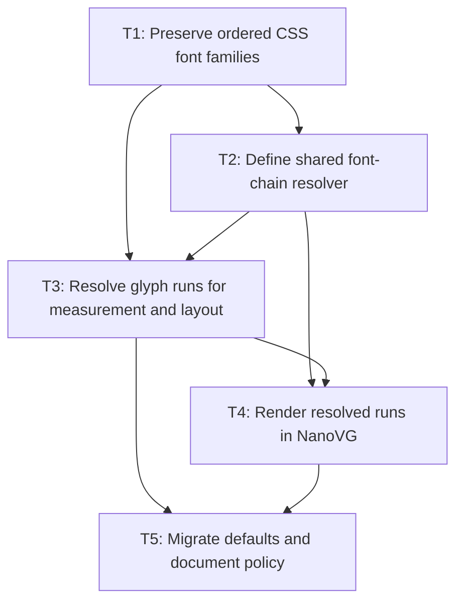

# Browser-Style Font Family Resolution Plan

## Goal

Make `font-family` an ordered CSS fallback chain. Every text consumer must resolve the same font for each glyph run so layout width, wrapping, clipping, rendering, mouse hit testing, selection, and caret movement agree. An explicitly configured system font may participate when loaded, but the default chain remains bundled and deterministic.

## Non-Goals

- Implicit operating-system fallback or machine-font discovery during normal rendering.
- Full browser text shaping parity, including HarfBuzz shaping, complex-script cluster segmentation, bidirectional reordering, ligatures, and variable-font axes.
- Changing the current default visual choice of Roboto for supported Latin glyphs.
- Removing direct icon or emoji font-family usage.

## Context

- `ResolvedStyle.fontFamilies()` and `FontPropertyProvider` currently use `Set<String>`, losing the CSS declaration order.
- `TextLayoutImpl`, input viewport/caret behavior, textarea metrics, inline formatting, block layout, and NanoVG input rendering each independently choose a single font with `findFirst()`.
- `FontServiceImpl` currently applies the temporary global `Font.fallbackFonts(...)` chain during measurement; `NvgFontRegistry` separately applies it during painting.
- Browser-like behavior needs a retained ordered family chain and resolved font runs, not independent primary-face selection at each layer.

## Assumptions and Open Questions

- Assumption: fallback remains code-point based for the first release. A future shaping subsystem can replace the resolver without changing its caller contract.
- Assumption: an unavailable family in CSS is skipped; it does not invalidate the declaration.
- Question: should generic families such as `sans-serif` map to bundled aliases in this release, or be rejected until an explicit alias registry exists?
- Question: should a loaded system font be allowed only when explicitly named in CSS, or also through a documented application-level fallback policy? The recommended answer is explicitly named only.

## Phase Tasks

### T1: Preserve Ordered CSS Font Families

**Purpose:** Make CSS declaration order observable and inherited without selecting any font yet.

**Depends on:** None.
**Enables:** T2, T3, T4.
**Parallelizable with:** None.

**Changes:**
- [ ] Replace the `Set<String>` `FONT_FAMILY` value with an immutable ordered `List<String>` throughout `ResolvedStyle`, style storage, inheritance, and test fixtures.
- [ ] Change `FontPropertyProvider` to preserve `TermList` order and duplicates semantics defined by CSS parsing; set the default to `Roboto, "Noto Sans CJK SC"`.
- [ ] Update CSS property tests for quoted names, comma-separated order, inheritance, and an unavailable family preceding an available family.

**Acceptance Checks:**
- [ ] A resolved style exposes `List.of("Roboto", "Noto Sans CJK SC")` in that order.
- [ ] No style caller depends on set iteration order.
- [ ] Core style test suite passes.

**Risks:** This is a source-compatible API change only if no external callers compile against `Set<String>`; document the migration in release notes if the core API is public.

### T2: Define a Shared Font-Chain Resolver

**Purpose:** Centralize family/style/weight matching and eliminate all single-font `findFirst()` copies.

**Depends on:** T1.
**Enables:** T3, T4, T5.
**Parallelizable with:** None.

**Changes:**
- [ ] Add a core font-resolution contract that accepts ordered family names plus style, weight, and stretch, and returns an ordered list of available `Font` faces.
- [ ] Define deterministic face matching: requested family order first; within a family, exact style/weight/stretch first, then documented nearest bundled face fallback.
- [ ] Move current duplicated resolution in text layout, inline/block layout, input viewport/mouse behavior, textarea metrics, and NanoVG input rendering to that contract.
- [ ] Define explicit handling for unavailable families and the final visible missing-glyph face/marker.

**Acceptance Checks:**
- [ ] One resolver test proves family order wins over registry insertion and hash iteration order.
- [ ] A loaded system font is selected only when named in the resolved CSS family list.
- [ ] Existing Roboto, icon, and emoji family-selection tests retain their selected primary face.

**Risks:** Style fallback rules are product-visible. Keep nearest-face matching narrowly specified and avoid silently selecting arbitrary system fonts.

### T3: Resolve Glyph Runs for Measurement and Layout

**Purpose:** Make core metrics match the font used for every rendered glyph.

**Depends on:** T1, T2.
**Enables:** T4, T5.
**Parallelizable with:** None.

**Changes:**
- [ ] Introduce an immutable resolved-text/run model containing source UTF-16 range, resolved `Font`, code points, and a visible replacement-marker run when no face supplies a glyph.
- [ ] Make `FontServiceImpl` resolve runs before measuring; reset kerning at font-run boundaries and retain source indices for caret/selection behavior.
- [ ] Extend text line/inline-fragment data only as needed to carry run fonts through line wrapping and clipping without re-resolving text in the renderer.
- [ ] Define a first-release cluster rule: surrogate pairs are atomic; document that grapheme clusters and complex shaping are deferred.

**Acceptance Checks:**
- [ ] `Røgue 雪 Seed` measures Roboto Latin and Noto CJK glyphs in one ordered run sequence.
- [ ] Caret coordinates, selection bounds, replacement, backspace, and delete remain correct around U+96EA and a supplementary-plane code point.
- [ ] An unsupported code point produces a non-zero-width U+FFFD marker run with a source range matching the original code point.

**Risks:** Text wrapping must never split a surrogate pair or desynchronize source indices from rendered runs. Stop and redesign the run index contract if this cannot be proven by tests.

### T4: Render Resolved Runs in NanoVG

**Purpose:** Paint exactly the faces selected by core instead of relying on NanoVG to independently discover fallbacks.

**Depends on:** T2, T3.
**Enables:** T5.
**Parallelizable with:** None.

**Changes:**
- [ ] Change text, input, and textarea NanoVG paths to set the face and draw each resolved run at the measured run advance.
- [ ] Keep `NvgFontRegistry` responsible for loading faces by `Font` identity, but remove global hardcoded fallback registration and `displayText` re-resolution once run data is supplied.
- [ ] Preserve clipping/scissor behavior and baseline alignment across adjacent runs with different font metrics.
- [ ] Add recording or headless NanoVG tests asserting face order and x positions for mixed Roboto/CJK, icon, emoji, and missing-glyph text.

**Acceptance Checks:**
- [ ] Renderer run positions equal core-measured cumulative advances within the existing pixel-rounding contract.
- [ ] Rendering an unsupported character draws the configured marker face rather than omitting the character.
- [ ] NanoVG backend tests pass without requiring a machine-installed font.

**Risks:** NanoVG's fallback API may remain useful as a defensive backend fallback, but it must not change the run positions selected by core.

### T5: Migrate Defaults, System-Font Policy, and Documentation

**Purpose:** Finalize public behavior and remove the temporary global fallback path.

**Depends on:** T3, T4.
**Enables:** None.
**Parallelizable with:** None.

**Changes:**
- [ ] Replace `Font.fallbackFonts(...)` with the style-derived font-chain resolver and remove duplicate fallback logic from `FontServiceImpl` and `NvgFontRegistry`.
- [ ] Document the default bundled chain, explicit system-font loading/selection, unavailable-family behavior, and missing-glyph marker behavior.
- [ ] Add a demo showing CSS family order with Roboto, Noto CJK, icon, emoji, and an unavailable family.
- [ ] Update package documentation and migration notes for the `ResolvedStyle.fontFamilies()` type change.

**Acceptance Checks:**
- [ ] Default CSS produces Roboto-first/Noto-CJK-second behavior without a hardcoded global fallback list.
- [ ] Systems with different installed fonts render the default chain identically.
- [ ] Full build, core tests, NanoVG tests, and `git diff --check` pass.

**Risks:** Removing the temporary path too early could regress text controls. Keep it only behind the shared resolver until all layout and renderer consumers use resolved runs.

## Verification Strategy

- Run focused parser/style tests after T1 and resolver tests after T2.
- Run core text metrics, inline layout, input viewport/caret, textarea selection, and supplementary-plane regression tests after T3.
- Run `./gradlew :spinygui.core.backend.lwjgl.nanovg:test` after T4.
- Run `./gradlew build` and `git diff --check` after T5.
- Manually verify copy/paste, selection replacement, clipping, and caret navigation for `Røgue 雪 Seed`, an icon-font glyph, an emoji-font glyph, and an unsupported code point.

## Review Boundaries

- Commit 1: ordered CSS family value and shared chain resolver.
- Commit 2: resolved glyph runs and all core measurement/layout consumers.
- Commit 3: NanoVG run painting and renderer regressions.
- Commit 4: default migration, documentation, and demo.

## Deferred Work

- HarfBuzz or equivalent shaping integration.
- Grapheme-cluster editing and Unicode line-breaking conformance.
- Generic family aliases and configurable application fallback policy.
- Variable-font axes and per-script language selection.

## Dependency Graph

