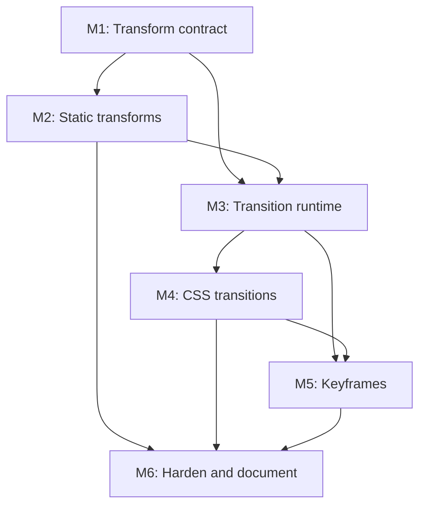

# E1: CSS Animation Support

## Goal
Deliver bounded CSS motion support in this order: static 2D transforms, paint-only transitions, then keyframe animations on the same deterministic timeline.

## Context
- High-level roadmap: `docs/features/css-animation-support-plan.md`.
- Layout geometry remains untransformed; visual transforms and pointer conversion share one affine contract.
- Existing uncommitted main-menu files are not implementation scope.

## Milestones

### M1: Transform contract
**Depends on:** None.
**Enables:** M2, M3.
**Parallelizable with:** None.

### M2: Static 2D transforms
**Depends on:** M1.
**Enables:** M3, M6.
**Parallelizable with:** None.

### M3: Transition runtime
**Depends on:** M1, M2.
**Enables:** M4, M5.
**Parallelizable with:** None.

### M4: CSS transitions
**Depends on:** M3.
**Enables:** M5, M6.
**Parallelizable with:** None.

### M5: Keyframe animations
**Depends on:** M3, M4.
**Enables:** M6.
**Parallelizable with:** None.

### M6: Harden and document
**Depends on:** M2, M4, M5.
**Enables:** None.
**Parallelizable with:** None.

## Cross-Cutting Risks
- Renderer-only transforms produce visual controls that cannot be clicked.
- Presented animation values must not overwrite computed CSS targets.
- Layout-affecting transitions and 3D transforms are explicitly deferred.

## Dependency Graph

