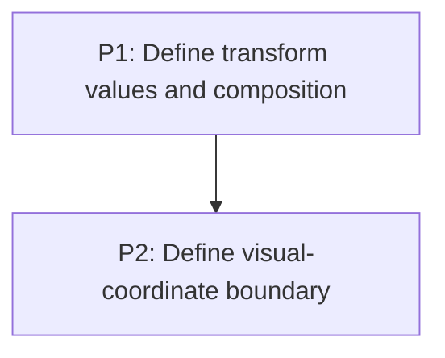

# M1: Transform contract

## Goal
Define one backend-neutral 2D transform and visual-coordinate contract before parser, renderer, or input work.

## Context
- Parent epic: `docs/work/E1 - CSS animation support.md`.
- Each phase document contains executable task nodes and acceptance checks.

## Phases

### P1: Define transform values and composition
**Purpose:** Bound values, origin semantics, composition, and inversion.

**Depends on:** None.
**Enables:** P2.
**Parallelizable with:** None.

### P2: Define visual-coordinate boundary
**Purpose:** Specify presentation-state ownership and clip/scroll/input ordering.

**Depends on:** P1.
**Enables:** None.
**Parallelizable with:** None.

## Validation
- Define one backend-neutral 2D transform and visual-coordinate contract before parser, renderer, or input work.

## Dependency Graph

