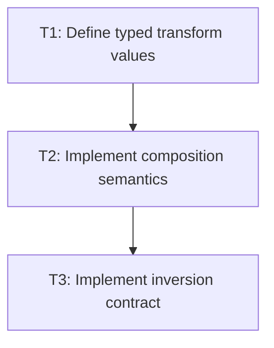

# P1: Define Transform Values and Composition

## Goal
Specify and test the backend-neutral affine model consumed by later CSS and renderer work.

## Non-Goals
- Work belonging to later milestones.

## Context
- Parent epic: `docs/work/E1 - CSS animation support.md`.
- The authoritative task dependencies in this document govern implementation order.

## Phase Tasks

### T1: Define typed transform values
**Purpose:** Model only first-release transform operations and origins.

**Depends on:** None.
**Enables:** T2.
**Parallelizable with:** None.

**Changes:**
- [x] Add immutable core types for none, translate, scale, rotate, and two-value transform origin.
- [x] Reject non-finite values and avoid NanoVG dependencies.

**Acceptance Checks:**
- [x] Construction tests cover all supported operations and invalid numeric inputs.
- [x] Defaults are explicitly represented.

**Risks:** A generic CSS AST would exceed this feature boundary.

### T2: Implement composition semantics
**Purpose:** Freeze transform-list and origin math.

**Depends on:** T1.
**Enables:** T3.
**Parallelizable with:** None.

**Changes:**
- [x] Choose and implement transform-list multiplication order in one method.
- [x] Resolve percentage translation/origin against border-box size and apply origin translate-transform-inverse origin.

**Acceptance Checks:**
- [x] Exact point tests include non-commutative rotate-plus-translate cases.
- [x] Zero-size percentage reference behavior is deterministic.

**Risks:** Reversed multiplication can pass trivial tests.

### T3: Implement inversion contract
**Purpose:** Support input conversion and singular behavior.

**Depends on:** T2.
**Enables:** None.
**Parallelizable with:** None.

**Changes:**
- [x] Provide inverse point mapping with explicit non-invertible result.
- [x] Define zero-scale transformed nodes as not pointer-targetable.

**Acceptance Checks:**
- [x] Invertible matrices round-trip points.
- [x] Zero-scale test proves documented rejection behavior.

**Risks:** Silent inversion fallback would create incorrect hit tests.

## Verification Strategy
- Run `.\gradlew.bat :spinygui.core:test --tests *Transform* --tests *Affine*`.

## Review Boundaries
- Keep this phase as one reviewable slice and exclude unrelated worktree modifications.

## Deferred Work
- Parsing, rendering, and 3D transforms.

## Dependency Graph

