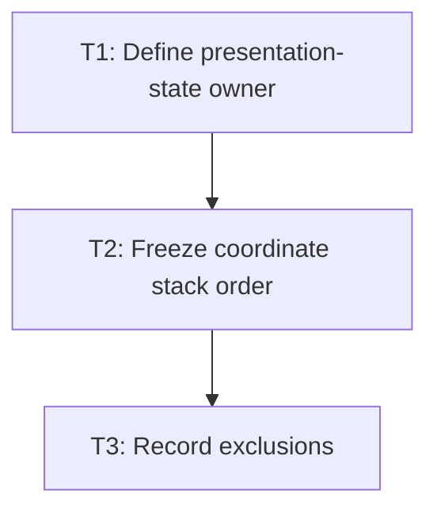

# P2: Define Visual-Coordinate Boundary

## Goal
Define ownership and transform/scroll/clip/debug/input ordering before implementation.

## Non-Goals
- Work belonging to later milestones.

## Context
- Parent epic: `docs/work/E1 - CSS animation support.md`.
- The authoritative task dependencies in this document govern implementation order.

## Coordinate Contract

Layout boxes, clip rectangles, and scroll metrics remain in layout space. `PresentationState` holds
only the current visual transform. Within the parent layout coordinate space, for a parent transform
`P`, parent scroll translation `S`, child layout offset `L`, and child transform `C`, child-local
paint coordinates map as:

`P * S * L * C * point`

The render traversal must apply this in the following order:

1. Save state and apply the parent visual transform `P` around its border box.
2. Paint the parent's background and border in that transformed coordinate space.
3. Install every overflow clip from the transformed parent content box. The clip uses `P`, but not
   the parent scroll translation.
4. Apply `S = translate(-scrollLeft, -scrollTop)` only while painting scrollable child content.
5. Apply each child's existing layout offset `L`, then its visual transform `C`, and paint its
   subtree recursively.
6. Paint scrollbars with `P`, but without `S`; their thumb geometry already reflects scroll state.
7. Restore state before a sibling is painted.

Input must first reject points outside each transformed overflow clip, then reverse the same map:
`C^-1`, `L^-1`, `S^-1`, `P^-1`. A missing inverse makes that transformed subtree non-targetable.

Debug output remains viewport/layout-space. It is rendered after the layout tree and must not inherit
presentation transforms, child scroll translations, or subtree clips. This preserves the existing
debug renderer's direct layout-box diagnostics.

## Static Transform Release Boundary

- Layout boxes, `layoutChildNodes`, normal-flow placement, client size, scroll size, and scroll
  offsets remain layout-space values and are not recomputed by a presentation transform.
- A transformed element affects its own paint and the paint of its descendants as one visual
  subtree. It does not establish a containing block for absolutely positioned descendants.
- Existing z-index sorting and paint order remain unchanged. A transform does not establish a
  stacking context in this release.
- Renderer and input implementations must consume `Element.presentationState()` at their shared
  traversal boundary. No leaf renderer, debug overlay, or hit-test special case may substitute a
  different transform source or write presentation values into `ResolvedStyle`.

## Phase Tasks

### T1: Define presentation-state owner
**Purpose:** Separate current paint values from computed CSS targets.

**Depends on:** None.
**Enables:** T2.
**Parallelizable with:** None.

**Changes:**
- [x] Specify node-owned or associated presentation state for current transform and future animation values.
- [x] Define reset on recalculation, display none, and node removal.

**Acceptance Checks:**
- [x] A focused test/spec proves computed ResolvedStyle is never overwritten.
- [x] Ownership and frame-thread boundary are named.

**Risks:** Mixing presented values into cascade state blocks retargeting.

### T2: Freeze coordinate stack order
**Purpose:** Use one render order and its exact input inverse.

**Depends on:** T1.
**Enables:** T3.
**Parallelizable with:** None.

**Changes:**
- [x] Document parent transform, scroll, overflow clip, child transform, and paint order.
- [x] Decide whether debug output is viewport-space or node-transformed.

**Acceptance Checks:**
- [x] Nested transform-scroll-clip examples have exact expected coordinates.
- [x] M2 renderer and input tasks reference this contract.

**Risks:** Different input/render ordering is a correctness defect.

### T3: Record exclusions
**Purpose:** Prevent accidental browser-scope expansion.

**Depends on:** T2.
**Enables:** None.
**Parallelizable with:** None.

**Changes:**
- [x] Record unchanged layout boxes, flow, client/scroll metrics, containing blocks, and z-index sorting.
- [x] Specify visual subtree inheritance without transform-created stacking contexts.

**Acceptance Checks:**
- [x] M2 acceptance checks prove layout geometry remains unchanged.
- [x] No renderer-only exception bypasses shared presentation state.

**Risks:** Implicit CSS-browser assumptions expand this milestone into layout work.

## Verification Strategy
- Run focused core coordinate tests with existing overflow/layout tests.

## Review Boundaries
- Keep this phase as one reviewable slice and exclude unrelated worktree modifications.

## Deferred Work
- Static CSS parsing and renderer calls.

## Dependency Graph

