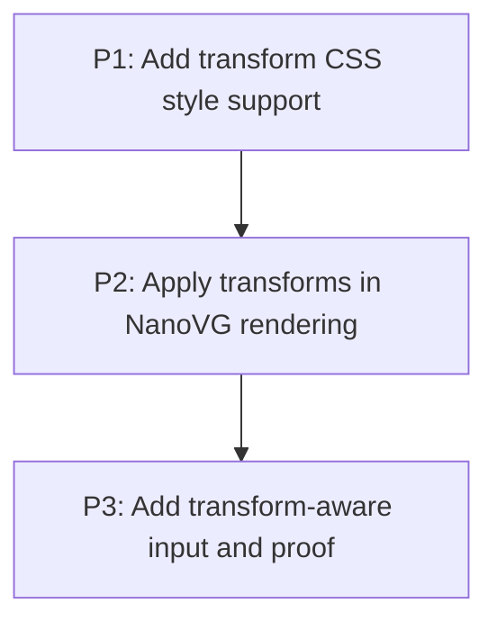

# M2: Static 2D transforms

## Goal
Support static transform and transform-origin through CSS parsing, NanoVG painting, clipping/scrolling, and pointer targeting.

## Context
- Parent epic: `docs/work/E1 - CSS animation support.md`.
- Each phase document contains executable task nodes and acceptance checks.

## Phases

### P1: Add transform CSS style support
**Purpose:** Parse, validate, default, and resolve typed declarations.

**Depends on:** None.
**Enables:** P2.
**Parallelizable with:** None.

### P2: Apply transforms in NanoVG rendering
**Purpose:** Paint complete element subtrees with balanced matrix state.

**Depends on:** P1.
**Enables:** P3.
**Parallelizable with:** None.

### P3: Add transform-aware input and proof
**Purpose:** Inverse-map pointer coordinates and prove interaction.

**Depends on:** P2.
**Enables:** None.
**Parallelizable with:** None.

## Validation
- Support static transform and transform-origin through CSS parsing, NanoVG painting, clipping/scrolling, and pointer targeting.

## Dependency Graph

