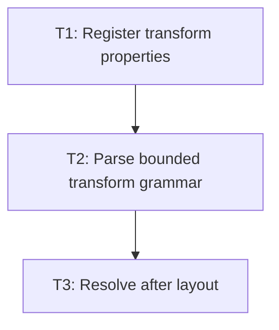

# P1: Add Transform CSS Style Support

## Goal
Make bounded transform declarations enter ResolvedStyle and resolve after layout size is available.

## Non-Goals
- Work belonging to later milestones.

## Context
- Parent epic: `docs/work/E1 - CSS animation support.md`.
- The authoritative task dependencies in this document govern implementation order.

## Phase Tasks

### T1: Register transform properties
**Purpose:** Expose transform and transform-origin through normal property discovery.

**Depends on:** None.
**Enables:** T2.
**Parallelizable with:** None.

**Changes:**
- [x] Add property constants, providers, defaults, and typed ResolvedStyle accessors.
- [x] Ensure stylesheet and inline-style paths use the same providers.

**Acceptance Checks:**
- [x] Empty declarations resolve to none and 50% 50%.
- [x] Style-manager tests use parsed CSS strings.

**Risks:** Defaults must not mask author declarations.

### T2: Parse bounded transform grammar
**Purpose:** Convert function terms to ordered typed operations.

**Depends on:** T1.
**Enables:** T3.
**Parallelizable with:** None.

**Changes:**
- [x] Accept only M1 functions and valid units/arity.
- [x] Reject matrix, skew, 3D, malformed origin, and partial-invalid declarations.

**Acceptance Checks:**
- [x] Parser tests cover all supported forms and malformed inputs.
- [x] Invalid declarations never apply a valid prefix.

**Risks:** Partial application is unpredictable for authors.

### T3: Resolve after layout
**Purpose:** Produce the presentation transform using final border-box geometry.

**Depends on:** T2.
**Enables:** None.
**Parallelizable with:** None.

**Changes:**
- [x] Resolve percentage origin/translation after final layout dimensions.
- [x] Keep target style values distinct from calculated presented matrix.

**Acceptance Checks:**
- [x] Percentage tests use final box size.
- [x] Layout and scroll metrics remain unchanged.

**Risks:** Earlier resolution uses incomplete geometry.

## Verification Strategy
- Run `.\gradlew.bat :spinygui.core:test --tests *Transform* --tests *StyleManager*`.

## Review Boundaries
- Keep this phase as one reviewable slice and exclude unrelated worktree modifications.

## Deferred Work
- NanoVG rendering and event conversion.

## Dependency Graph

