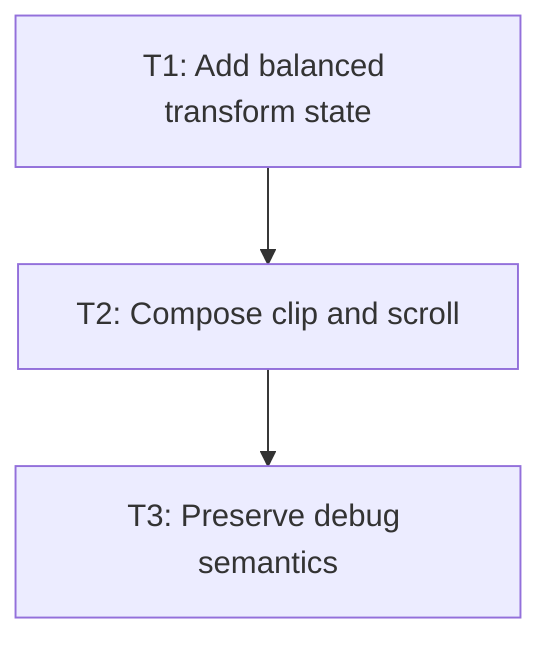

# P2: Apply Transforms in NanoVG Rendering

## Goal
Paint every transformed subtree through one balanced NanoVG matrix/clip/scroll boundary.

## Non-Goals
- Work belonging to later milestones.

## Context
- Parent epic: `docs/work/E1 - CSS animation support.md`.
- The authoritative task dependencies in this document govern implementation order.
- Coordinate contract: `docs/work/E1/M1/P2/P2 - Define visual-coordinate boundary.md`.
- Presentation source: `Element.presentationState()` is the only transform source for this phase.

## Phase Tasks

### T1: Add balanced transform state
**Purpose:** Map M1 affine matrices to NanoVG save-transform-restore calls.

**Depends on:** None.
**Enables:** T2.
**Parallelizable with:** None.

**Changes:**
- [ ] Add a renderer adapter rather than leaking NanoVG into core style types.
- [ ] Wrap all element subtree paths, including empty children.
- [ ] Read presentation state only at the shared subtree boundary; no leaf renderer may bypass it.

**Acceptance Checks:**
- [ ] Recording tests prove save/restore balance.
- [ ] Sibling paint never inherits a prior child transform.
- [ ] Rendering leaves layout boxes, flow, scroll metrics, and z-index ordering unchanged.

**Risks:** State leakage corrupts unrelated elements.

### T2: Compose clip and scroll
**Purpose:** Apply the M1 ordering across complete subtrees.

**Depends on:** T1.
**Enables:** T3.
**Parallelizable with:** None.

**Changes:**
 - [x] Place transforms at existing traversal boundaries so background, border, text, input, textarea, and scrollbars agree.
 - [x] Test transformed content inside overflow scroll containers.
- [ ] Keep transformed descendants in the visual subtree without creating a containing block or stacking context.

**Acceptance Checks:**
 - [x] Nested transforms and scroll offsets produce expected recorded positions.
 - [x] Visual clipping follows transformed coordinates.

**Risks:** Leaf-specific transforms split subtree behavior.

### T3: Preserve debug semantics
**Purpose:** Implement the explicit M1 debug decision.

**Depends on:** T2.
**Enables:** None.
**Parallelizable with:** None.

**Changes:**
 - [x] Apply the chosen debug coordinate space and test it.
 - [x] Keep frame-level debug behavior unchanged unless the contract states otherwise.

**Acceptance Checks:**
 - [x] Debug output does not observe stale transform state.
 - [x] Existing renderer tests remain green.

**Risks:** Debug paints can retain state after a subtree.

## Verification Strategy
- Run `.\gradlew.bat :spinygui.core.backend.lwjgl.nanovg:test --tests *Nvg*RendererTest`.

## Review Boundaries
- Keep this phase as one reviewable slice and exclude unrelated worktree modifications.

## Deferred Work
- Event hit testing and transitions.

## Dependency Graph

