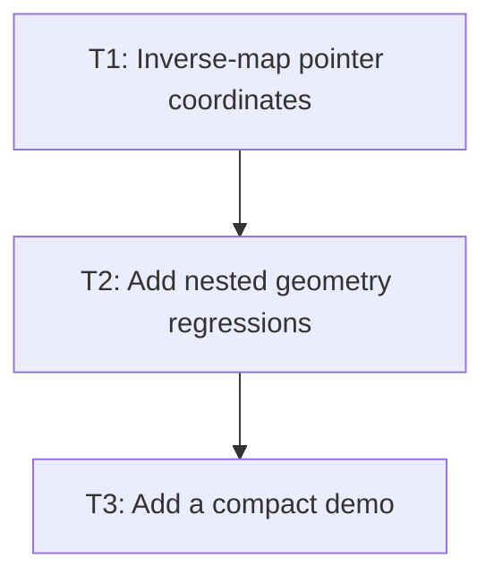

# P3: Add Transform-Aware Input and Visible Proof

## Goal
Use the renderer-equivalent inverse stack for pointer targeting and add automated/visible proof.

## Non-Goals
- Work belonging to later milestones.

## Context
- Parent epic: `docs/work/E1 - CSS animation support.md`.
- The authoritative task dependencies in this document govern implementation order.
- Coordinate contract: `docs/work/E1/M1/P2/P2 - Define visual-coordinate boundary.md`.
- Presentation source: use `Element.presentationState()`; never mutate `ResolvedStyle` for input.

## Phase Tasks

### T1: Inverse-map pointer coordinates
**Purpose:** Convert input through transformed ancestors before bounds checks.

**Depends on:** None.
**Enables:** T2.
**Parallelizable with:** None.

**Changes:**
 - [x] Apply exact reverse transform order per ancestor.
 - [x] Preserve existing pointer-events, visibility, clipping, and child traversal rules.

**Acceptance Checks:**
 - [x] Translated, rotated, and scaled targets hit only at their visual locations.
 - [x] Singular/clipped targets cannot be selected.
 - [x] Input mapping leaves layout geometry and computed style unchanged.

**Risks:** Input and renderer ordering must remain identical.

### T2: Add nested geometry regressions
**Purpose:** Cover inputs under transforms, clips, and scroll containers.

**Depends on:** T1.
**Enables:** T3.
**Parallelizable with:** None.

**Changes:**
 - [x] Test transformed input/button/textarea targeting.
 - [x] Add nested transform plus scroll/overflow cases.

**Acceptance Checks:**
 - [x] Existing overflow/input tests stay green.
 - [x] Tests distinguish visual transform from layout-box movement.

**Risks:** Simple click tests miss ancestor composition defects.

### T3: Add a compact demo
**Purpose:** Show static transform behavior without absorbing current main-menu changes.

**Depends on:** T2.
**Enables:** None.
**Parallelizable with:** None.

**Changes:**
 - [x] Add isolated translate/scale/rotate CSS proof in complex demo.
 - [x] Use real CSS parsing and include interaction where practical.

**Acceptance Checks:**
 - [x] Demo classes compile.
 - [x] Visible behavior is backed by geometry tests.

**Risks:** Demo-only evidence is insufficient.

## Verification Strategy
- Run focused transform/input tests and `.\gradlew.bat :spinygui.demo.complex:classes`.

## Review Boundaries
- Keep this phase as one reviewable slice and exclude unrelated worktree modifications.

## Deferred Work
- Transitions and keyframes.

## Dependency Graph

