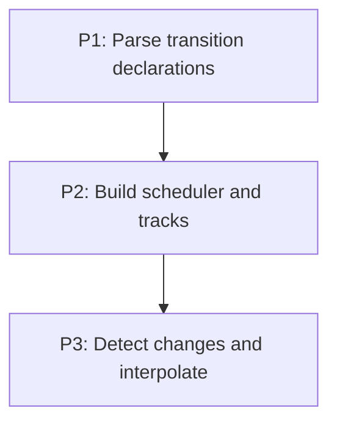

# M3: Transition runtime

## Goal
Create deterministic, retargetable presentation tracks from style changes without mutating computed CSS.

## Context
- Parent epic: `docs/work/E1 - CSS animation support.md`.
- Phase documents are implementation instructions; their task dependencies are authoritative.

## Phases

### P1: Parse transition declarations
**Purpose:** Define typed transition configuration.

**Depends on:** None.
**Enables:** P2.
**Parallelizable with:** None.

### P2: Build scheduler and tracks
**Purpose:** Own animation lifecycle and time.

**Depends on:** P1.
**Enables:** P3.
**Parallelizable with:** None.

### P3: Detect changes and interpolate
**Purpose:** Bridge cascade targets to presented values.

**Depends on:** P2.
**Enables:** None.
**Parallelizable with:** None.

## Validation
- Create deterministic, retargetable presentation tracks from style changes without mutating computed CSS.

## Dependency Graph

