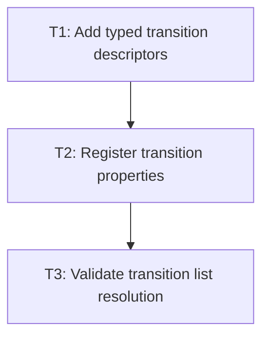

# P1: Parse transition declarations

## Goal
Represent the bounded CSS transition grammar as validated typed configuration that later runtime code can consume without reparsing CSS.

## Non-Goals
- Starting tracks, updating presentation state, or rendering intermediate values.
- Keyframe animation declarations.

## Context
- Parent epic: `docs/work/E1 - CSS animation support.md`.
- Parent milestone: `docs/work/E1/M3 - Transition runtime.md`.
- Use the existing property-provider, parser visitor, and `ResolvedStyle` pipeline.
- The initial grammar supports `none`, `all`, the M3 supported property names, comma-separated lists, named easings, and `cubic-bezier(...)`.

## Assumptions and Open Questions
- Assumption: unsupported transition targets are rejected or resolve as non-transitionable later; they must not silently create runtime tracks.
- Decision: list values repeat to the number of `transition-property` entries; a later explicit entry for the same property wins over `all` and earlier entries.

## Phase Tasks

### T1: Add typed transition descriptors
**Purpose:** Model property selection, durations, delays, timing functions, and resolved descriptor entries.

**Depends on:** None.
**Enables:** T2.
**Parallelizable with:** None.

**Task document:** [T1 - Add typed transition descriptors](P1/T1%20-%20Add%20typed%20transition%20descriptors.md)

**Scope summary:** Add core-only immutable values and defaults, with no dependency on NanoVG or the scheduler.

### T2: Register transition properties
**Purpose:** Expose transition longhands and shorthand through stylesheet and inline-style processing.

**Depends on:** T1.
**Enables:** T3.
**Parallelizable with:** None.

**Task document:** [T2 - Register transition properties](P1/T2%20-%20Register%20transition%20properties.md)

**Scope summary:** Add providers, defaults, typed accessors, and all-or-nothing declaration validation.

### T3: Validate transition list resolution
**Purpose:** Make shorthand/longhand list matching and duplicate-property selection deterministic.

**Depends on:** T2.
**Enables:** `P2/T1`, `P3/T3`.
**Parallelizable with:** None.

**Task document:** [T3 - Validate transition list resolution](P1/T3%20-%20Validate%20transition%20list%20resolution.md)

**Scope summary:** Specify and test the descriptor lookup behavior the change detector will use.

## Verification Strategy
- Run `./gradlew.bat :spinygui.core:test --tests *Transition* --tests *StyleManager*`.

## Review Boundaries
- Review typed value/model work before property-provider parsing and list-resolution tests.

## Deferred Work
- Keyframe and `animation` property parsing belongs to E1/M5.

## Dependency Graph

