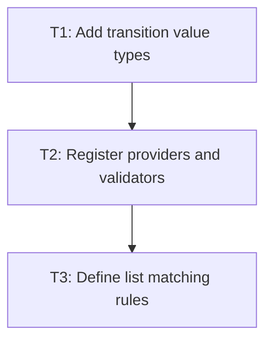

# P1: Parse transition declarations

## Goal
Add typed parsing, defaults, and validation for the bounded CSS transition grammar.

## Non-Goals
- Running animations or rendering intermediate values.

## Context
- Use the existing PropertyProvider and ResolvedStyle pipeline.
- The initial syntax supports `none`, `all`, supported property names, lists, standard easings, and cubic-bezier.

## Phase Tasks

### T1: Add transition value types
**Purpose:** Represent property lists, times, easing, and shorthand expansion.

**Depends on:** None.
**Enables:** T2.
**Parallelizable with:** None.

**Changes:
- [ ] Add immutable transition descriptor/value types and default `all 0s ease 0s` behavior.
- [ ] Keep a raw property-name token only until the supported-property registry validates it.

**Acceptance Checks:**
- [ ] Parsed longhands and shorthand resolve to equivalent typed descriptors.
- [ ] No type depends on NanoVG or an animator implementation.

**Risks:** Avoid a generic CSS value model wider than this feature.

### T2: Register providers and validators
**Purpose:** Expose longhands and shorthand through stylesheet and inline styles.

**Depends on:** T1.
**Enables:** T3.
**Parallelizable with:** None.

**Changes:
- [ ] Register `transition-property`, duration, delay, timing-function, and shorthand providers.
- [ ] Reject negative durations, malformed cubic-bezier values, unknown properties, and partial invalid lists.

**Acceptance Checks:**
- [ ] Style-manager tests use CSS strings for defaults, comma lists, and invalid declarations.
- [ ] An invalid declaration leaves the prior valid computed target intact.

**Risks:** CSS list parsing must not silently truncate mismatched entries.

### T3: Define list matching rules
**Purpose:** Make list length and `all` resolution deterministic.

**Depends on:** T2.
**Enables:** None.
**Parallelizable with:** None.

**Changes:
- [ ] Document repeat-to-match behavior for list lengths and precedence of explicit property over `all`.
- [ ] Add unit tests for zero duration, delay, and duplicate property entries.

**Acceptance Checks:**
- [ ] Every configured property has one resolved timing descriptor.
- [ ] Tests name the selected rule for duplicates and list repetition.

**Risks:** Undocumented CSS edge behavior would block stable retargeting.

## Verification Strategy
- Run `.\gradlew.bat :spinygui.core:test --tests *Transition* --tests *StyleManager*`.

## Review Boundaries
- Keep this phase in one reviewable slice; do not include unrelated current worktree changes.

## Deferred Work
- Keyframe animation declarations.

## Dependency Graph

