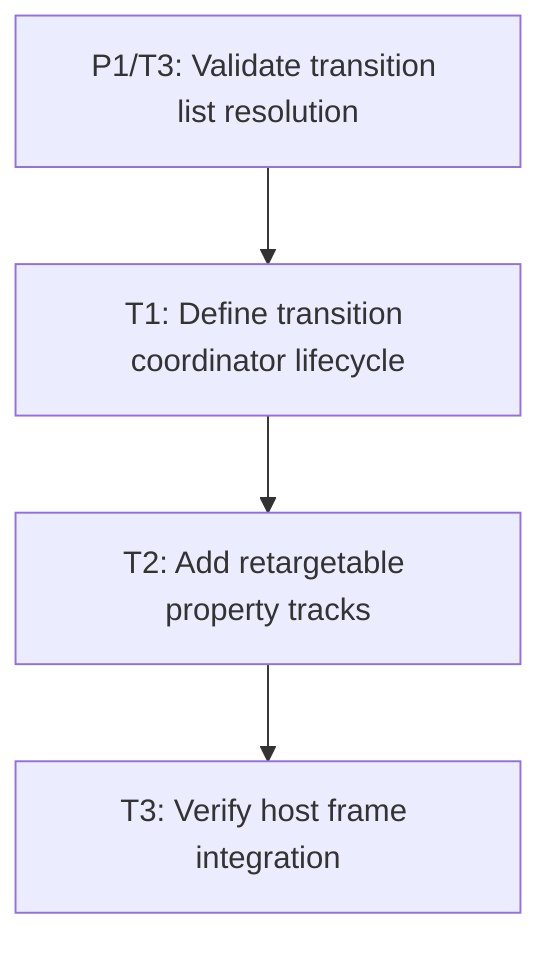

# P2: Build scheduler and tracks

## Goal
Provide a deterministic, host-owned transition coordinator that advances retargetable tracks through an explicit public update boundary.

## Non-Goals
- Creating a shared application/frame runtime.
- CSS declaration parsing or renderer presentation reads.

## Context
- Parent epic: `docs/work/E1 - CSS animation support.md`.
- Parent milestone: `docs/work/E1/M3 - Transition runtime.md`.
- `AnimatorImpl` currently has no production owner and its first call can use epoch-relative elapsed time.
- The complex demo currently calls `animator.runAnimations()` after rendering; this is evidence only, not the integration contract.
- The selected M3 decision is an explicit core host API (for example, a coordinator `tick`/`update` method) called once per frame after style changes are detected and before layout/render. A reusable frame runtime is deferred to E2.

## Assumptions and Open Questions
- Assumption: existing manual service composition remains supported; hosts opt into the coordinator rather than a new required runtime.
- Assumption: the coordinator writes only to `Element.presentationState()` and never changes `ResolvedStyle` targets.

## Phase Tasks

### T1: Define transition coordinator lifecycle
**Purpose:** Establish core ownership, deterministic clock initialization, cancellation, and cleanup behavior.

**Depends on:** `P1/T3`.
**Enables:** T2.
**Parallelizable with:** None.

**Task document:** [T1 - Define transition coordinator lifecycle](P2/T1%20-%20Define%20transition%20coordinator%20lifecycle.md)

**Scope summary:** Publish the small host-facing update contract and either wrap or narrowly correct `AnimatorImpl` lifecycle gaps.

### T2: Add retargetable property tracks
**Purpose:** Represent delay, easing, progress, current presented value, and computed target independently.

**Depends on:** T1.
**Enables:** T3.
**Parallelizable with:** None.

**Task document:** [T2 - Add retargetable property tracks](P2/T2%20-%20Add%20retargetable%20property%20tracks.md)

**Scope summary:** Add deterministic generic tracks that start replacements from the current presentation value.

### T3: Verify host frame integration
**Purpose:** Prove the public update boundary works in a real host without renderer coupling.

**Depends on:** T2.
**Enables:** `P3/T1`.
**Parallelizable with:** None.

**Task document:** [T3 - Verify host frame integration](P2/T3%20-%20Verify%20host%20frame%20integration.md)

**Scope summary:** Integrate the explicit call ordering in a demo/harness and document it for non-demo hosts.

## Verification Strategy
- Run deterministic coordinator and track tests using a fake `TimeService`.
- Compile the updated host integration with `./gradlew.bat :spinygui.demo.complex:classes`.

## Review Boundaries
- Keep public lifecycle/track behavior separate from future frame-runtime composition work.

## Deferred Work
- E2 defines an optional standard runtime that may invoke this coordinator; it must not replace manual host composition in M3.

## Dependency Graph

