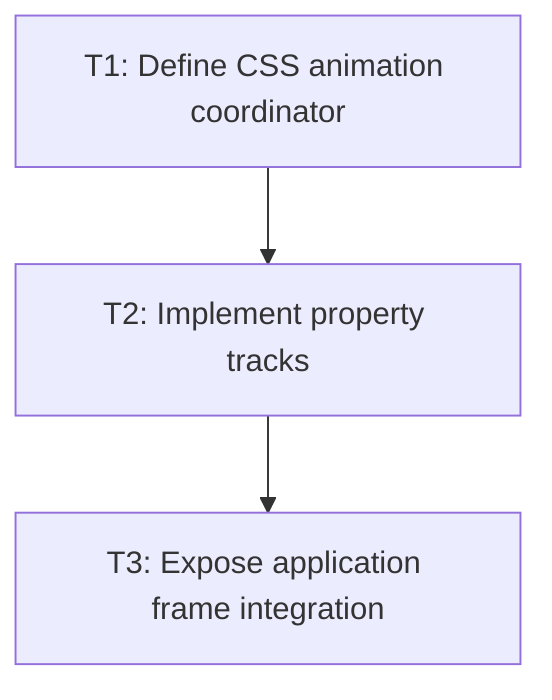

# P2: Build scheduler and tracks

## Goal
Give CSS animation a production-owned frame update boundary and reliable lifecycle.

## Non-Goals
- CSS declaration parsing and renderer integration.

## Context
- `AnimatorImpl` exists but has no confirmed production caller.
- The scheduler must run before render and avoid mutating ResolvedStyle.

## Phase Tasks

### T1: Define CSS animation coordinator
**Purpose:** Own tracks, current time, and per-frame invalidation.

**Depends on:** None.
**Enables:** T2.
**Parallelizable with:** None.

**Changes:
- [ ] Introduce a coordinator around Animator or replace only the lifecycle gaps that prevent CSS semantics.
- [ ] Define first-frame delta, cancellation, completion, and node-removal cleanup.

**Acceptance Checks:**
- [ ] A fake TimeService proves zero first-frame movement and exactly-once completion.
- [ ] No track remains after its node is removed or display becomes none.

**Risks:** A renderer-owned scheduler would exclude non-demo applications.

### T2: Implement property tracks
**Purpose:** Represent delay, easing, progress, and retargetable source/target values.

**Depends on:** T1.
**Enables:** T3.
**Parallelizable with:** None.

**Changes:
- [ ] Add typed track state with current presented value distinct from computed target.
- [ ] Retarget from the current presented value when a target changes mid-flight.

**Acceptance Checks:**
- [ ] Clock tests prove delay, progress, completion, and interruption behavior.
- [ ] Retargeting has no visible jump at the replacement frame.

**Risks:** Tracks must not read stale starting values.

### T3: Expose application frame integration
**Purpose:** Connect the coordinator at one documented frame boundary.

**Depends on:** T2.
**Enables:** None.
**Parallelizable with:** None.

**Changes:
- [ ] Locate the shared application update/render path or add a small explicit public tick boundary.
- [ ] Add an integration test or demo harness that advances one frame without NanoVG coupling.

**Acceptance Checks:**
- [ ] A real frame loop advances a track before it is rendered.
- [ ] The contract identifies ownership and call order for future hosts.

**Risks:** If no shared host exists, stop and expose a host-facing API rather than embedding logic in NvgRenderer.

## Verification Strategy
- Run focused coordinator tests with deterministic time.

## Review Boundaries
- Keep this phase in one reviewable slice; do not include unrelated current worktree changes.

## Deferred Work
- Keyframe-specific timeline semantics.

## Dependency Graph

