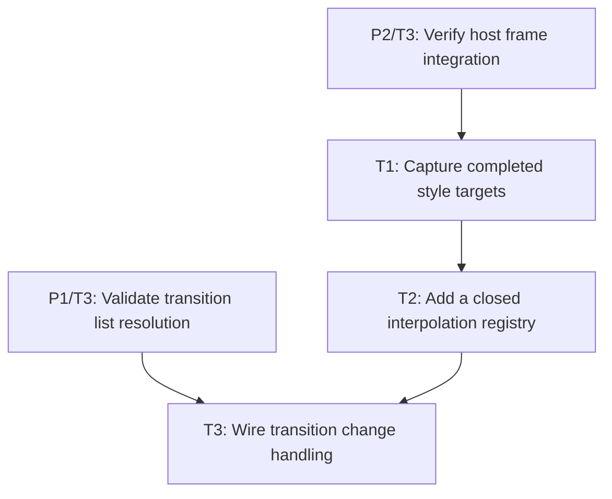

# P3: Detect changes and interpolate

## Goal
Turn successful computed-style changes into bounded presentation tracks while preserving computed CSS targets as the cascade source of truth.

## Non-Goals
- Reading intermediate values in all renderer paint paths; that is E1/M4.
- Interpolating layout-affecting or otherwise unsupported values.

## Context
- Parent epic: `docs/work/E1 - CSS animation support.md`.
- Parent milestone: `docs/work/E1/M3 - Transition runtime.md`.
- `StyleManagerImpl` currently clears and reapplies `ResolvedStyle`, then resets presentation state; it has no completed-style notification boundary.
- M1/M2 established `Element.presentationState()` as the visual state boundary and a static transform model.

## Assumptions and Open Questions
- Assumption: a transition is considered only after a complete successful cascade result, including defaults; failed inline parsing retains the prior computed target and does not trigger a track.
- Assumption: discrete, layout-affecting, missing, and incompatible values resolve immediately to their computed target.

## Phase Tasks

### T1: Capture completed style targets
**Purpose:** Provide one old/new comparison per successfully recalculated element and notify the coordinator after the cascade completes.

**Depends on:** `P2/T3`.
**Enables:** T2.
**Parallelizable with:** None.

**Task document:** [T1 - Capture completed style targets](P3/T1%20-%20Capture%20completed%20style%20targets.md)

**Scope summary:** Preserve target snapshots around the `StyleManager` boundary without exposing half-applied rules.

### T2: Add a closed interpolation registry
**Purpose:** Limit track creation to compatible paint and transform value pairs.

**Depends on:** T1.
**Enables:** T3.
**Parallelizable with:** None.

**Task document:** [T2 - Add a closed interpolation registry](P3/T2%20-%20Add%20a%20closed%20interpolation%20registry.md)

**Scope summary:** Define type-specific interpolation and explicit immediate fallback behavior.

### T3: Wire transition change handling
**Purpose:** Apply resolved descriptors to computed changes, retarget active tracks, and clean up visibility/removal cases.

**Depends on:** T2, `P1/T3`.
**Enables:** E1/M4, E1/M5.
**Parallelizable with:** None.

**Task document:** [T3 - Wire transition change handling](P3/T3%20-%20Wire%20transition%20change%20handling.md)

**Scope summary:** Create, replace, cancel, or skip tracks according to the approved descriptor and fallback rules.

## Verification Strategy
- Run `./gradlew.bat :spinygui.core:test --tests *Transition* --tests *Animation* --tests *StyleManager*`.
- Add fake-clock cases for delay, easing, completion, interruption, removal, and `display: none`.

## Review Boundaries
- Keep cascade snapshots, value interpolation, and lifecycle wiring as separate reviewable changes.

## Deferred Work
- Renderer presentation reads and visible CSS transition proof belong to E1/M4.

## Dependency Graph

