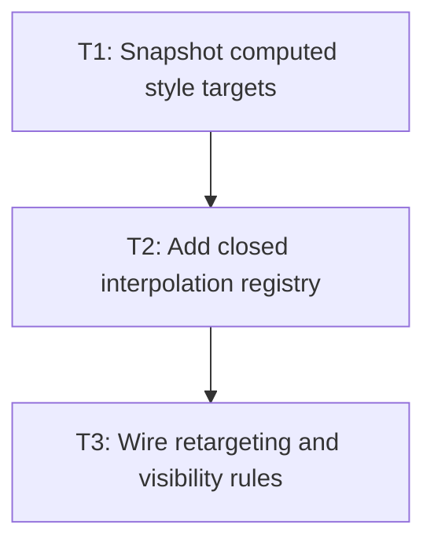

# P3: Detect changes and interpolate

## Goal
Convert successful style recomputation into supported presented-value tracks.

## Non-Goals
- Painting intermediate values in all renderers; that belongs to M4.

## Context
- StyleManagerImpl clears and reapplies ResolvedStyle during recalculate.
- M1/M2 established presentation state and transform model.

## Phase Tasks

### T1: Snapshot computed style targets
**Purpose:** Capture old and new resolved values around a successful cascade update.

**Depends on:** None.
**Enables:** T2.
**Parallelizable with:** None.

**Changes:
- [ ] Add a per-element computed-target snapshot at the StyleManager/coordinator boundary.
- [ ] Notify only after all declarations and defaults have been applied.

**Acceptance Checks:**
- [ ] Inline style and stylesheet changes produce one old/new comparison.
- [ ] Failed parsing does not create a transition.

**Risks:** Snapshot timing must not observe half-applied rules.

### T2: Add closed interpolation registry
**Purpose:** Limit animation to compatible paint and transform values.

**Depends on:** T1.
**Enables:** T3.
**Parallelizable with:** None.

**Changes:
- [ ] Implement interpolation for opacity, color/background/border color, transform, and box-shadow only after compatibility is proven.
- [ ] Classify discrete and layout-affecting properties as immediate.

**Acceptance Checks:**
- [ ] Each supported type has midpoint and endpoint tests.
- [ ] Unsupported values never create tracks.

**Risks:** Interpolating layout values without invalidation is out of scope.

### T3: Wire retargeting and visibility rules
**Purpose:** Apply transition descriptors to detected differences.

**Depends on:** T2.
**Enables:** None.
**Parallelizable with:** None.

**Changes:
- [ ] Create, replace, or cancel tracks based on descriptor and new value.
- [ ] Define display-none, node removal, zero duration, and non-interpolable pair behavior.

**Acceptance Checks:**
- [ ] One style change creates one track; a second starts at current presentation.
- [ ] Tests prove no stale track survives hide/remove.

**Risks:** Incorrect cancellation will leak state across reused elements.

## Verification Strategy
- Run `.\gradlew.bat :spinygui.core:test --tests *Transition* --tests *Animation*`.

## Review Boundaries
- Keep this phase in one reviewable slice; do not include unrelated current worktree changes.

## Deferred Work
- Renderer presentation reads and demo behavior.

## Dependency Graph

