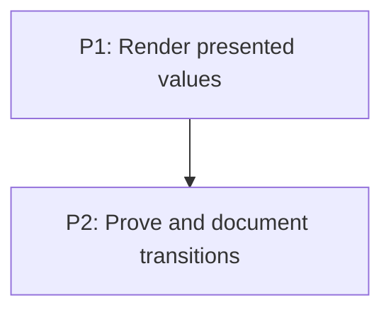

# M4: CSS transitions

## Goal
Render the approved transition subset end to end and make its support boundary visible.

## Context
- Parent epic: `docs/work/E1 - CSS animation support.md`.
- Phase documents are implementation instructions; their task dependencies are authoritative.

## Phases

### P1: Render presented values
**Purpose:** Route current values to paint paths.

**Depends on:** None.
**Enables:** P2.
**Parallelizable with:** None.

### P2: Prove and document transitions
**Purpose:** Add demo, regression coverage, and support docs.

**Depends on:** P1.
**Enables:** None.
**Parallelizable with:** None.

## Validation
- Render the approved transition subset end to end and make its support boundary visible.

## Dependency Graph

