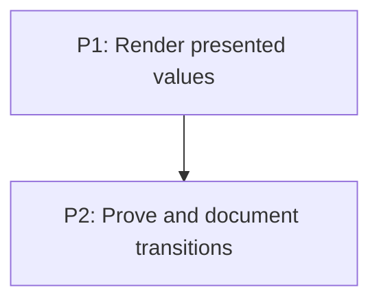

# M4: CSS transitions

**Status:** Implemented subset

## Goal
Render the approved transition subset end to end and make its support boundary visible.

## Context
- Parent epic: `docs/work/E1 - CSS animation support.md`.
- Phase documents are implementation instructions; their task dependencies are authoritative.

## Phases

### P1: Render presented values
**Purpose:** Route current values to paint paths.

**Depends on:** None.
**Enables:** P2.
**Parallelizable with:** None.

**Phase document:** `docs/work/E1/M4/P1 - Render presented values.md`.

### P2: Prove and document transitions
**Purpose:** Add demo, regression coverage, and support docs.

**Depends on:** P1.
**Enables:** None.
**Parallelizable with:** None.

**Phase document:** `docs/work/E1/M4/P2 - Prove and document transitions.md`.

## Validation
- The delivered subset is opacity, text/background/border colors, and compatible 2D transforms.
- Layout, discrete, incompatible, box-shadow, and scrollbar pseudo-part values remain immediate
  or deferred.
- Focused core and NanoVG recording coverage is present; Gradle verification is pending because
  this environment has no configured JDK.

## Dependency Graph

