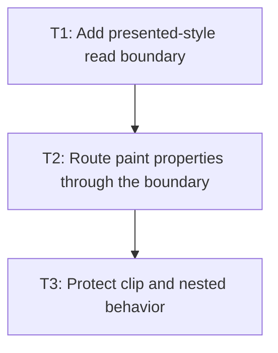

# P1: Render presented values

## Goal
Route the M3 presentation overlay to approved NanoVG paint paths while layout continues to read computed style.

## Non-Goals
- Adding layout-property transitions, box-shadow transitions, or scrollbar pseudo-part transitions.
- Changing the host order established by M3.

## Context
- Parent epic: `docs/work/E1 - CSS animation support.md`.
- Parent milestone: `docs/work/E1/M4 - CSS transitions.md`.
- M3 stores current paint values on `Element.presentationState()` and keeps computed targets in `ResolvedStyle`.
- `LayoutServiceImpl` resolves the existing transform matrix after sizing; it must compose the presented transform rather than alter layout geometry.

## Assumptions and Open Questions
- Assumption: the M4 target subset is opacity, text/background/border colors, and compatible 2D transforms.
- Decision: box-shadow and scrollbar pseudo-part transitions are deferred because M3 has no supported interpolator or part-keyed overlay for them.

## Phase Tasks

### T1: Add presented-style read boundary
**Purpose:** Give paint code one typed current-or-computed access point.

**Depends on:** None.
**Enables:** T2.
**Parallelizable with:** None.

**Task document:** [T1 - Add presented-style read boundary](P1/T1%20-%20Add%20presented-style%20read%20boundary.md)

### T2: Route paint properties through the boundary
**Purpose:** Make all supported NanoVG element paint paths consume presented values consistently.

**Depends on:** T1.
**Enables:** T3.
**Parallelizable with:** None.

**Task document:** [T2 - Route paint properties through the boundary](P1/T2%20-%20Route%20paint%20properties%20through%20the%20boundary.md)

### T3: Protect clip and nested behavior
**Purpose:** Regress presentation reads under transforms, clipping, scrolling, and controls.

**Depends on:** T2.
**Enables:** P2/T1.
**Parallelizable with:** None.

**Task document:** [T3 - Protect clip and nested behavior](P1/T3%20-%20Protect%20clip%20and%20nested%20behavior.md)

## Verification Strategy
- Run `./gradlew.bat :spinygui.core.backend.lwjgl.nanovg:test --tests *Nvg*RendererTest`.

## Deferred Work
- Box-shadow and scrollbar pseudo-part transitions.
- Layout, discrete, incompatible, and keyframe animation behavior.

## Dependency Graph

