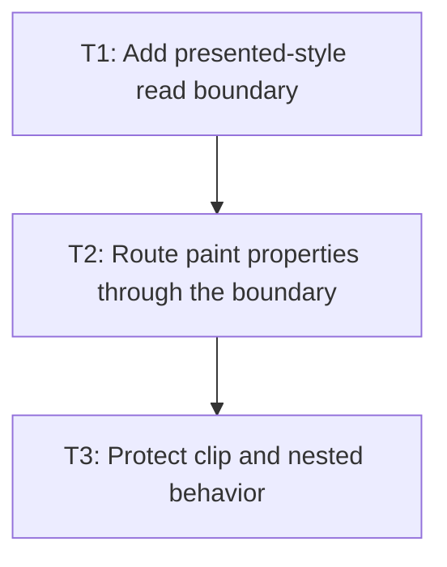

# P1: Render presented values

## Goal
Make every approved transitionable property paint from presentation state while layout reads computed style.

## Non-Goals
- Adding new transitionable layout properties.

## Context
- Approved properties: opacity, color/background/border colors, compatible box-shadow, and transform.
- NanoVG renderers currently read ResolvedStyle directly.

## Phase Tasks

### T1: Add presented-style read boundary
**Purpose:** Provide renderer-safe access to current-or-computed values.

**Depends on:** None.
**Enables:** T2.
**Parallelizable with:** None.

**Changes:
- [ ] Add one accessor/resolver for presented paint values; do not scatter map lookups through renderers.
- [ ] Fall back exactly to computed style when no track exists.

**Acceptance Checks:**
- [ ] A no-animation renderer test remains byte-for-byte equivalent in recorded output.
- [ ] Presentation state cannot affect layout accessors.

**Risks:** Duplicated fallback logic will drift between renderer types.

### T2: Route paint properties through the boundary
**Purpose:** Update all affected NanoVG paint surfaces.

**Depends on:** T1.
**Enables:** T3.
**Parallelizable with:** None.

**Changes:
- [ ] Route element, border, text, input, textarea, and scrollbar paint reads for the approved property set.
- [ ] Route transform via the M2 matrix boundary, not a leaf renderer special case.

**Acceptance Checks:**
- [ ] Intermediate opacity/color/transform values appear in recording tests.
- [ ] Input/caret and scrollbar tests remain green.

**Risks:** A partially migrated subtree creates mismatched parent/child visuals.

### T3: Protect clip and nested behavior
**Purpose:** Regress transition rendering under existing complex geometry.

**Depends on:** T2.
**Enables:** None.
**Parallelizable with:** None.

**Changes:
- [ ] Test transitions on nested transformed nodes and inside overflow scroll containers.
- [ ] Verify final value commits visually while layout metrics remain stable.

**Acceptance Checks:**
- [ ] Clip, scroll, and save/restore recording tests pass at intermediate progress.
- [ ] No layout test changes solely from a paint transition.

**Risks:** Visual-only animation must not corrupt scrolling.

## Verification Strategy
- Run `.\gradlew.bat :spinygui.core.backend.lwjgl.nanovg:test --tests *Nvg*RendererTest`.

## Review Boundaries
- Keep this phase in one reviewable slice; do not include unrelated current worktree changes.

## Deferred Work
- Layout-property transitions.

## Dependency Graph

