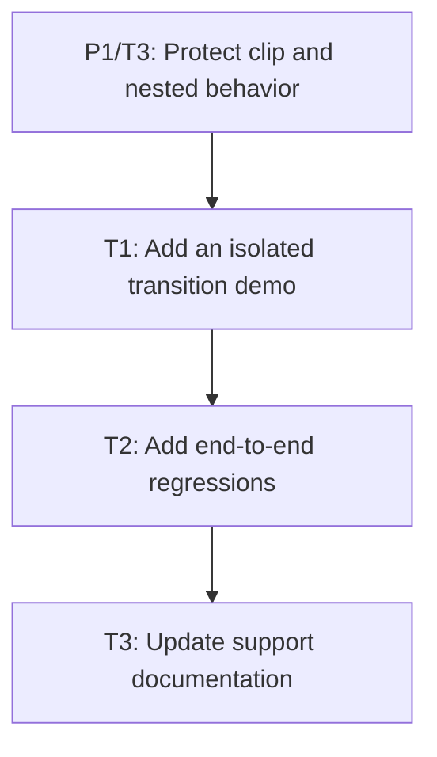

# P2: Prove and document transitions

## Goal
Provide deterministic end-to-end evidence and accurately document only the delivered M4 transition subset.

## Non-Goals
- Keyframes, box-shadow transitions, scrollbar pseudo-part transitions, and browser-wide compatibility.

## Context
- Parent epic: `docs/work/E1 - CSS animation support.md`.
- Parent milestone: `docs/work/E1/M4 - CSS transitions.md`.
- P1 establishes the renderer read boundary before user-visible proof work begins.

## Phase Tasks

### T1: Add an isolated transition demo
**Purpose:** Exercise real CSS transition declarations without depending on unrelated demo work.

**Depends on:** `P1/T3`.
**Enables:** T2.
**Parallelizable with:** None.

**Task document:** [T1 - Add an isolated transition demo](P2/T1%20-%20Add%20an%20isolated%20transition%20demo.md)

### T2: Add end-to-end regressions
**Purpose:** Prove scheduler-to-render behavior at deterministic timestamps.

**Depends on:** T1.
**Enables:** T3.
**Parallelizable with:** None.

**Task document:** [T2 - Add end-to-end regressions](P2/T2%20-%20Add%20end-to-end%20regressions.md)

### T3: Update support documentation
**Purpose:** Record delivered support and explicit deferrals.

**Depends on:** T2.
**Enables:** E1/M5, E1/M6.
**Parallelizable with:** None.

**Task document:** [T3 - Update support documentation](P2/T3%20-%20Update%20support%20documentation.md)

## Verification Strategy
- Run `./gradlew.bat :spinygui.core:test :spinygui.core.backend.lwjgl.nanovg:test :spinygui.demo.complex:classes`.

## Deferred Work
- Keyframes, box-shadow transitions, scrollbar pseudo-part transitions, layout transitions, and discrete-property animation.

## Dependency Graph

