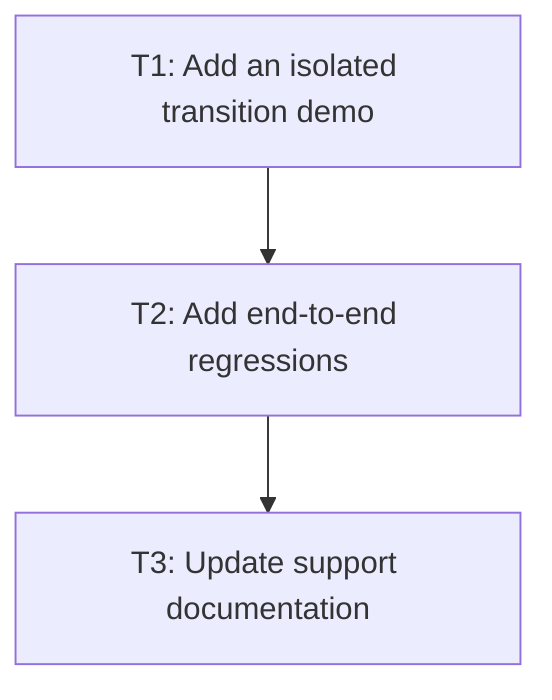

# P2: Prove and document transitions

## Goal
Provide user-visible evidence and accurately mark only delivered CSS support.

## Non-Goals
- Keyframes and broader browser compatibility.

## Context
- The demo must not reuse unrelated current main-menu work without an explicit follow-up.
- css-properties-support.md is the support truth.

## Phase Tasks

### T1: Add an isolated transition demo
**Purpose:** Exercise real style changes in a compact complex-demo example.

**Depends on:** None.
**Enables:** T2.
**Parallelizable with:** None.

**Changes:
- [ ] Add hover/focus or programmatic changes covering opacity, color, and transform.
- [ ] Keep visual behavior separate from test-only clock advancement.

**Acceptance Checks:**
- [ ] Demo compiles and visibly has an intermediate transition state.
- [ ] Demo CSS uses the actual transition shorthand/longhands.

**Risks:** A demo alone cannot validate timing.

### T2: Add end-to-end regressions
**Purpose:** Prove scheduler-to-render results with deterministic time.

**Depends on:** T1.
**Enables:** T3.
**Parallelizable with:** None.

**Changes:
- [ ] Add core-to-NanoVG tests for initial, midpoint, retargeted, and completed states.
- [ ] Include input focus/caret, scrollbar, clip, and nested transform regressions.

**Acceptance Checks:**
- [ ] Focused tests prove values at known timestamps.
- [ ] Existing block/flex/overflow/input suites stay green.

**Risks:** Flaky wall-clock tests are unacceptable.

### T3: Update support documentation
**Purpose:** Mark implementation truth and exclusions.

**Depends on:** T2.
**Enables:** None.
**Parallelizable with:** None.

**Changes:
- [ ] Update css-properties-support checklist and the feature roadmap for actually supported transition declarations/targets.
- [ ] Document immediate behavior for discrete/layout properties and deferred transition work.

**Acceptance Checks:**
- [ ] Docs name supported timing functions and property subset.
- [ ] No unsupported property is marked supported.

**Risks:** Premature support claims become API debt.

## Verification Strategy
- Run `.\gradlew.bat :spinygui.core:test :spinygui.core.backend.lwjgl.nanovg:test :spinygui.demo.complex:classes`.

## Review Boundaries
- Keep this phase in one reviewable slice; do not include unrelated current worktree changes.

## Deferred Work
- Keyframes.

## Dependency Graph

