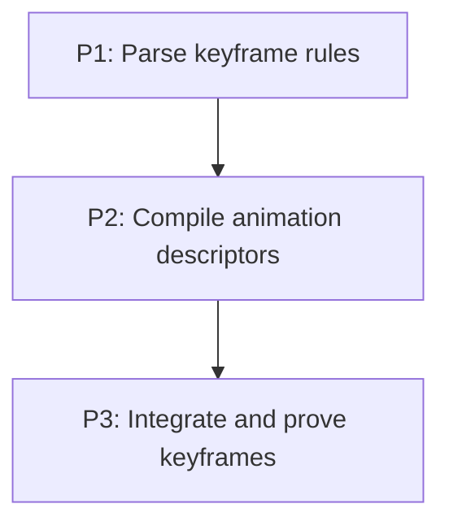

# M5: Keyframe animations

**Status:** Planned

## Goal
Add @keyframes and animation declarations on the transition scheduler and interpolation registry.

## Context
- Parent epic: `docs/work/E1 - CSS animation support.md`.
- Phase documents are implementation instructions; their task dependencies are authoritative.

## Phases

### P1: Parse keyframe rules
**Purpose:** Materialize typed stylesheet at-rules.

**Depends on:** None.
**Enables:** P2.
**Parallelizable with:** None.

### P2: Compile animation descriptors
**Purpose:** Resolve CSS animation declarations into timeline tracks.

**Depends on:** P1.
**Enables:** P3.
**Parallelizable with:** None.

### P3: Integrate and prove keyframes
**Purpose:** Define precedence and end-to-end behavior.

**Depends on:** P2.
**Enables:** None.
**Parallelizable with:** None.

## Validation
- Add @keyframes and animation declarations on the transition scheduler and interpolation registry.

## Dependency Graph

