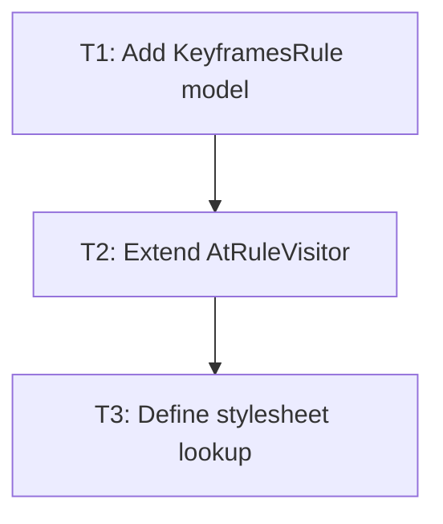

# P1: Parse keyframe rules

## Goal
Turn existing grammar keyframe productions into typed stylesheet data.

## Non-Goals
- Per-keyframe timing functions and non-core CSS at-rules.

## Context
- The grammar exposes keyframes but AtRuleVisitor materializes only FontFaceRule.
- StyleSheet already stores atRules.

## Phase Tasks

### T1: Add KeyframesRule model
**Purpose:** Represent named keyframe blocks and selectors.

**Depends on:** None.
**Enables:** T2.
**Parallelizable with:** None.

**Changes:
- [ ] Add typed at-rule/keyframe block models for from/to/percentage selectors and parsed declarations.
- [ ] Define duplicate-selector merge order.

**Acceptance Checks:**
- [ ] Model tests prove selector normalization and ordered declarations.
- [ ] No runtime animation classes are required.

**Risks:** Do not treat raw parser contexts as long-lived stylesheet state.

### T2: Extend AtRuleVisitor
**Purpose:** Create KeyframesRule values from supported grammar forms.

**Depends on:** T1.
**Enables:** T3.
**Parallelizable with:** None.

**Changes:
- [ ] Implement visitor methods and reset per-rule visitor state safely.
- [ ] Reject malformed names/selectors and unsupported declaration values explicitly.

**Acceptance Checks:**
- [ ] Parser tests include from/to, percentages, multiple blocks, and invalid input.
- [ ] Multiple stylesheets retain independent rules.

**Risks:** Visitor state leaks can join separate at-rules.

### T3: Define stylesheet lookup
**Purpose:** Specify name lookup and duplicate rules across stylesheets.

**Depends on:** T2.
**Enables:** None.
**Parallelizable with:** None.

**Changes:
- [ ] Add lookup/helper with document-order behavior and explicit missing-name result.
- [ ] Test multiple active stylesheets and duplicate names.

**Acceptance Checks:**
- [ ] Animation resolver can query a stable named-keyframe result.
- [ ] Missing names do not throw or create phantom tracks.

**Risks:** CSS cascade details must be bounded and documented.

## Verification Strategy
- Run `./gradlew.bat :spinygui.core:test --tests *Keyframes* --tests *StyleSheet*`.

## Review Boundaries
- Keep this phase in one reviewable slice; do not include unrelated current worktree changes.

## Deferred Work
- Animation property parsing.

## Dependency Graph

