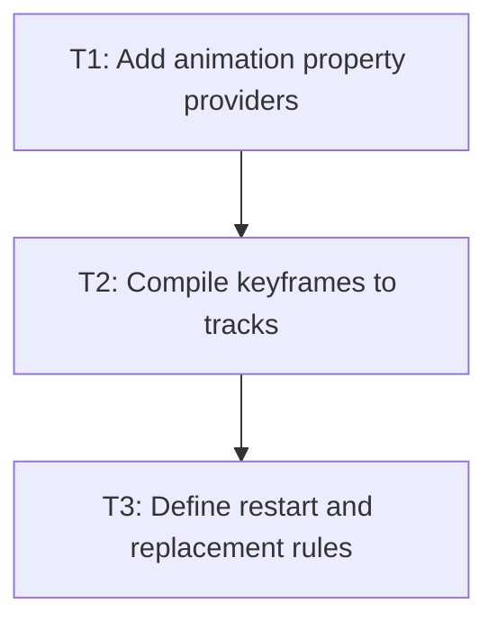

# P2: Compile animation descriptors

## Goal
Parse animation CSS and compile it into existing typed property tracks.

## Non-Goals
- A second scheduler or interpolation system.

## Context
- M3 owns timing/tracks; M5 must reuse it.
- The same interpolation registry limits animatable keyframe declarations.

## Phase Tasks

### T1: Add animation property providers
**Purpose:** Parse animation longhands and shorthand into typed descriptors.

**Depends on:** None.
**Enables:** T2.
**Parallelizable with:** None.

**Changes:
- [ ] Register name, duration, delay, timing, iteration count, direction, fill mode, play state, and shorthand.
- [ ] Support finite/infinite iterations, normal/reverse/alternate, fill modes, and paused/running.

**Acceptance Checks:**
- [ ] Longhand/shorthand equivalence and invalid-value tests pass.
- [ ] Defaults are explicit and stable.

**Risks:** Shorthand ambiguity should reject unsupported forms.

### T2: Compile keyframes to tracks
**Purpose:** Resolve descriptors and construct timeline segments.

**Depends on:** T1.
**Enables:** T3.
**Parallelizable with:** None.

**Changes:
- [ ] Resolve names against active stylesheets, normalize missing start/end values, and use the shared interpolation registry.
- [ ] Implement delay, iteration, direction, fill, and pause/resume state.

**Acceptance Checks:**
- [ ] Deterministic clock tests cover finite/infinite repeat, alternate direction, and fill modes.
- [ ] Paused state holds its presented value.

**Risks:** Keyframes may not mutate CSS target state.

### T3: Define restart and replacement rules
**Purpose:** Handle style changes and missing definitions safely.

**Depends on:** T2.
**Enables:** None.
**Parallelizable with:** None.

**Changes:
- [ ] Specify restart-on-animation-style-change and cancellation on node removal/display none.
- [ ] Retain computed target fallback when no active keyframe value applies.

**Acceptance Checks:**
- [ ] Changing animation-name or duration restarts predictably.
- [ ] Removing a node leaves no coordinator state.

**Risks:** Unclear restart rules will make author edits non-deterministic.

## Verification Strategy
- Run focused animation tests with fake time.

## Review Boundaries
- Keep this phase in one reviewable slice; do not include unrelated current worktree changes.

## Deferred Work
- Transition precedence integration.

## Dependency Graph

