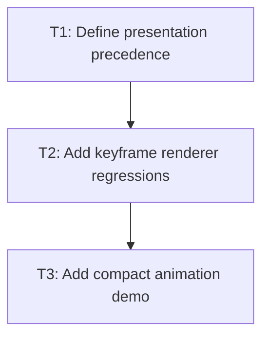

# P3: Integrate and prove keyframes

## Goal
Set animation/transition presentation precedence and add parser-to-renderer proof.

## Non-Goals
- Scroll-driven animations and Web Animations API.

## Context
- Keyframes and transitions write to the same presented-value overlay.
- M4 established render-path coverage.

## Phase Tasks

### T1: Define presentation precedence
**Purpose:** Choose behavior when keyframes and transitions target one property.

**Depends on:** None.
**Enables:** T2.
**Parallelizable with:** None.

**Changes:
- [ ] Document a bounded precedence rule and implement it at the coordinator registry boundary.
- [ ] Prevent lower-priority tracks from overwriting the displayed value.

**Acceptance Checks:**
- [ ] A competing transform/opacity test proves the selected winner.
- [ ] Completion restores the next applicable source predictably.

**Risks:** Per-property precedence must not depend on renderer order.

### T2: Add keyframe renderer regressions
**Purpose:** Exercise intermediate and completion frames through NanoVG.

**Depends on:** T1.
**Enables:** T3.
**Parallelizable with:** None.

**Changes:
- [ ] Record transform and opacity at multiple keyframe stops.
- [ ] Cover nested transform, clipping, and node removal during active animation.

**Acceptance Checks:**
- [ ] NanoVG state remains balanced and output matches fake-clock expectations.
- [ ] Existing transition tests remain green.

**Risks:** A parser-only keyframes test does not prove display.

### T3: Add compact animation demo
**Purpose:** Provide a visible non-interactive proof slice.

**Depends on:** T2.
**Enables:** None.
**Parallelizable with:** None.

**Changes:
- [ ] Add a small demo using @keyframes, finite/infinite iteration, and pause/resume if host control is available.
- [ ] Keep resource changes isolated from unrelated demos.

**Acceptance Checks:**
- [ ] Demo classes compile and parser recognizes the at-rule.
- [ ] Support documentation has evidence for every checked item.

**Risks:** Do not make animation support depend on demo-specific loop code.

## Verification Strategy
- Run final core, NanoVG, and demo class verification.

## Review Boundaries
- Keep this phase in one reviewable slice; do not include unrelated current worktree changes.

## Deferred Work
- 3D animation and additional interpolable types.

## Dependency Graph

