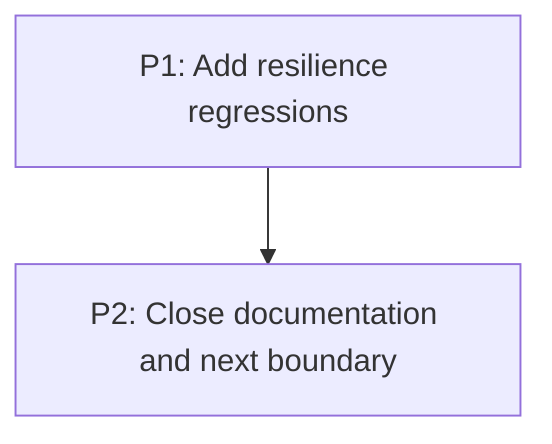

# M6: Harden and document

**Status:** Planned

## Goal
Lock delivered behavior with resilience tests and maintain an exact support boundary.

## Context
- Parent epic: `docs/work/E1 - CSS animation support.md`.
- Phase documents are implementation instructions; their task dependencies are authoritative.

## Phases

### P1: Add resilience regressions
**Purpose:** Cover cleanup, geometry, and lifecycle edge cases.

**Depends on:** None.
**Enables:** P2.
**Parallelizable with:** None.

### P2: Close documentation and next boundary
**Purpose:** Publish support truth and deliberately defer next work.

**Depends on:** P1.
**Enables:** None.
**Parallelizable with:** None.

## Validation
- Lock delivered behavior with resilience tests and maintain an exact support boundary.

## Dependency Graph

