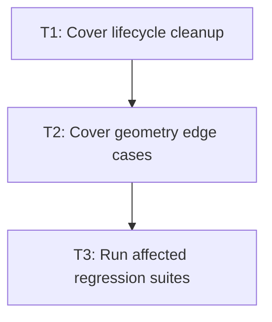

# P1: Add resilience regressions

## Goal
Prove cleanup, invalid input, coordinate edge cases, and affected subsystem compatibility.

## Non-Goals
- Adding features.

## Context
- M2, M4, and M5 define the delivered surface.
- Regression work must stay narrow and evidence-driven.

## Phase Tasks

### T1: Cover lifecycle cleanup
**Purpose:** Test removal, hide, replacement, and frame teardown.

**Depends on:** None.
**Enables:** T2.
**Parallelizable with:** None.

**Changes:
- [ ] Add tests for node removal, display none, animation cancellation/replacement, and coordinator teardown.
- [ ] Assert no pending tracks or stale presented values remain.

**Acceptance Checks:**
- [ ] Each cleanup path has an observable empty-state assertion.
- [ ] No test depends on wall-clock timing.

**Risks:** Leaks may be hidden until long-running applications.

### T2: Cover geometry edge cases
**Purpose:** Test singular transforms and clip/scroll nesting.

**Depends on:** T1.
**Enables:** T3.
**Parallelizable with:** None.

**Changes:
- [ ] Add zero-size origin, zero-scale, nested clips, scroll offsets, and transformed input tests.
- [ ] Verify inverse pointer mapping agrees with paint coordinates.

**Acceptance Checks:**
- [ ] All edge cases have explicit expected behavior.
- [ ] No layout metrics change for paint-only motion.

**Risks:** Coordinate defects require nested cases.

### T3: Run affected regression suites
**Purpose:** Verify compatibility before docs change.

**Depends on:** T2.
**Enables:** None.
**Parallelizable with:** None.

**Changes:
- [ ] Run focused transform/transition/animation tests plus block, flex, overflow, input, textarea, and NanoVG renderer suites.
- [ ] Record any environment failure separately from code failure.

**Acceptance Checks:**
- [ ] All intended commands pass or have documented external blockers.
- [ ] `git diff --check` passes.

**Risks:** Do not mark support from partial test evidence.

## Verification Strategy
- Run `.\gradlew.bat :spinygui.core:test :spinygui.core.backend.lwjgl.nanovg:test :spinygui.demo.complex:classes`.

## Review Boundaries
- Keep this phase in one reviewable slice; do not include unrelated current worktree changes.

## Deferred Work
- New capabilities.

## Dependency Graph

