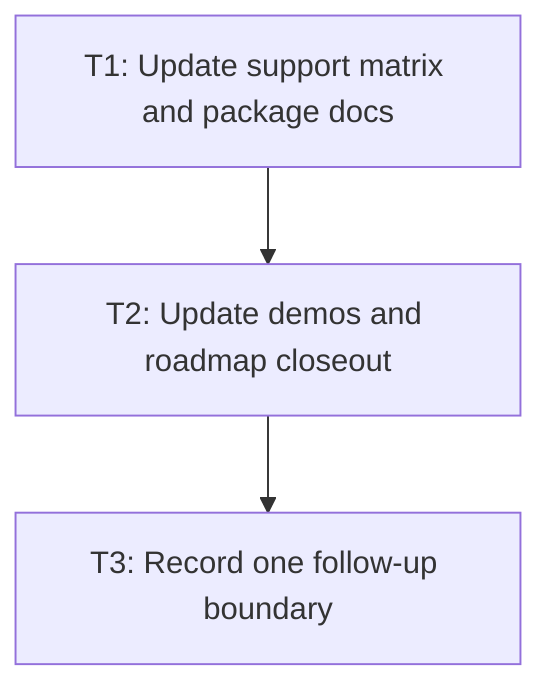

# P2: Close documentation and next boundary

## Goal
Make support claims match passing evidence and capture only one next design decision.

## Non-Goals
- Implementing layout animation, 3D transforms, or a new backend.

## Context
- css-properties-support.md and package docs are user-facing contract surfaces.
- The parent feature roadmap remains the high-level rationale.

## Phase Tasks

### T1: Update support matrix and package docs
**Purpose:** Document exact delivered syntax and exclusions.

**Depends on:** None.
**Enables:** T2.
**Parallelizable with:** None.

**Changes:
- [ ] Mark only tested transform, transition, keyframe, and animation entries supported.
- [ ] List unsupported functions, timing variants, layout properties, and 3D behavior.

**Acceptance Checks:**
- [ ] Every checked property links to or is backed by tests.
- [ ] Documentation does not claim browser equivalence.

**Risks:** Vague docs invite unsupported use.

### T2: Update demos and roadmap closeout
**Purpose:** Record verification and status without touching unrelated work.

**Depends on:** T1.
**Enables:** T3.
**Parallelizable with:** None.

**Changes:
- [ ] Update feature roadmap/checklists with completed milestone evidence.
- [ ] Add concise demo run instructions if a new demo entry point exists.

**Acceptance Checks:**
- [ ] Docs point to the correct stable paths.
- [ ] Current main-menu modifications remain outside this closeout unless separately adopted.

**Risks:** Closeout must not hide unverified visual smoke.

### T3: Record one follow-up boundary
**Purpose:** Choose the next planning target, not implementation.

**Depends on:** T2.
**Enables:** None.
**Parallelizable with:** None.

**Changes:
- [ ] Document a decision record for layout-property transitions, 3D transforms, or additional paint interpolation.
- [ ] State required invalidation, layout, input, and renderer questions before any follow-up starts.

**Acceptance Checks:**
- [ ] One bounded follow-up is identified with prerequisites.
- [ ] No speculative code or support checkboxes are added.

**Risks:** Bundling every future CSS feature recreates an unbounded roadmap.

## Verification Strategy
- Run `git diff --check` and full affected-module verification before marking closeout complete.

## Review Boundaries
- Keep this phase in one reviewable slice; do not include unrelated current worktree changes.

## Deferred Work
- Implementation of the selected follow-up.

## Dependency Graph

