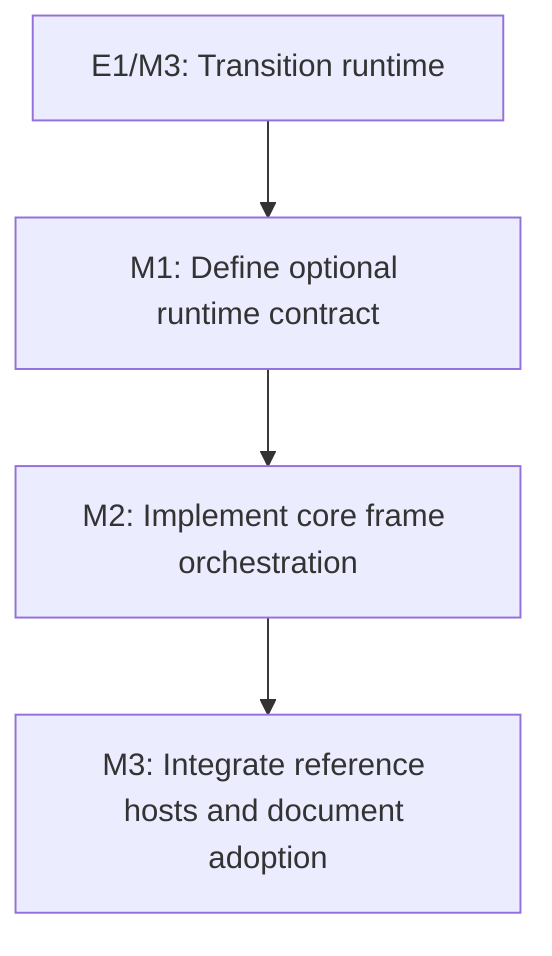

# E2: Frame runtime integration

**Status:** Planned

## Goal
Offer an optional, higher-level frame runtime that composes existing manual services in one documented lifecycle while retaining direct host integration as a supported path.

## Context

> **Current status note:** No frame-runtime implementation was found in the current
> checkout. The checked documents under `docs/work/E2/M1/P1/` describe the separate
> font-family resolution initiative and should not be treated as evidence for this epic.

- E1/M3 establishes the explicit host-owned transition coordinator update boundary; it is the prerequisite integration contract.
- Current demos manually assemble parsing, style, layout, event, renderer, and animation services, and no shared runtime owns their ordering.
- The runtime must remain backend-agnostic: renderers consume a styled/laid-out `Frame` and core must not depend on NanoVG.

## Milestones

### M1: Define optional runtime contract
**Status:** Planned
**Purpose:** Specify ownership, public lifecycle, extension points, and coexistence with manually composed hosts.

**Depends on:** E1/M3.
**Enables:** M2.
**Parallelizable with:** None.

**Architectural Proposition:** Introduce an opt-in core runtime facade that receives existing service interfaces through explicit composition; it does not replace or hide the individual services.

**Key Work:**
- Define lifecycle entry points, ownership/disposal rules, frame invalidation, error boundaries, and renderer/backend extension points.
- Lock the minimum frame ordering for event processing, style recalculation, transition update, layout, and rendering.
- Define compatibility guarantees for direct `StyleManager`, `LayoutService`, `Animator`/coordinator, and renderer users.

**Validation:** A reviewed public contract and fake-service ordering tests make it possible to implement without guessing behavior.

### M2: Implement core frame orchestration
**Status:** Planned
**Purpose:** Provide the opt-in runtime implementation and deterministic lifecycle tests.

**Depends on:** M1.
**Enables:** M3.
**Parallelizable with:** None.

**Architectural Proposition:** The runtime coordinates existing core interfaces rather than reimplementing style, layout, event, or animation work.

**Key Work:**
- Build an explicit composition API and a single-frame update path with deterministic service call order.
- Surface host-controlled invalidation and retain the ability to provide custom clocks, event sources, and renderers.
- Add lifecycle, teardown, and failure-isolation tests using fakes.

**Validation:** A fake host proves each service runs exactly in documented order, and manual composition remains source/binary compatible where feasible.

### M3: Integrate reference hosts and document adoption
**Status:** Planned
**Purpose:** Validate the option in demos and provide an incremental adoption path.

**Depends on:** M2.
**Enables:** None.
**Parallelizable with:** None.

**Architectural Proposition:** Migrate only selected reference hosts first; do not make the runtime mandatory for custom applications.

**Key Work:**
- Move one demo to the runtime with its existing backend and prove rendering/input/animation behavior.
- Document manual versus runtime integration, migration steps, supported extension points, and shutdown obligations.
- Add regression coverage for style changes and transition ticks occurring before rendered frames.

**Validation:** The migrated demo compiles/runs, lifecycle tests pass, and the manual M3 integration example remains valid.

## Cross-Cutting Risks
- A runtime that constructs concrete backend services would violate core backend neutrality; use interfaces and host-provided adapters.
- Making the runtime mandatory would break the library's existing manual composition model; preserve both paths.
- Hard-coding a frame order without invalidation/teardown semantics can create missed redraws or leaked tracks; define these in M1 before implementation.

## Verification / Review Strategy
- Review M1 as an API/ownership decision before implementation.
- Use fake service ordering/lifecycle tests for M2, then compile/run only targeted reference hosts for M3.
- Confirm E1/M3's standalone coordinator integration remains supported throughout.

## Dependency Graph

