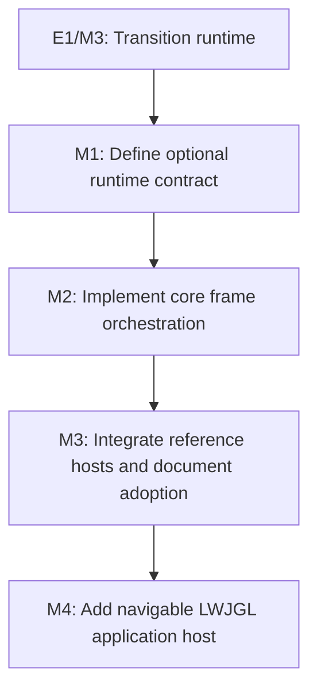

# E2: Frame runtime integration

**Status:** Complete with verification caveat

## Goal
Provide owner-native phase contracts, a backend-independent `FramePipeline`, and an optional
reusable LWJGL application host with browser-like navigation and modal behavior while retaining
manual host composition as a first-class integration path.

## Context

> **Current status note:** The experimental `core.frame` implementation was removed.
> Owner-native outcomes, `FramePipeline`, and the reusable LWJGL host are now the
> accepted boundaries. The checked documents under `docs/work/E2/M1/P1/` describe the
> separate font-family resolution initiative and are not evidence for this epic.

## Approved architecture

- Delete the experimental `com.spinyowl.spinygui.core.frame` subsystem rather than evolve a parallel ownership model.
- Return input, style, transition, and layout outcomes from their existing service owners.
- Let `Frame` own invalidation state and a source revision, but never service or host-loop references.
- Keep rendering and window operations outside backend-independent `FramePipeline`.
- Use `poll -> input -> update -> style -> transition -> layout/transform -> render -> swap` as the canonical order.
- Provide a dependency-injected reusable LWJGL loop while retaining `Demo` as a manually assembled low-level example.
- Model screen/document changes through `FrameNavigator`; do not model modals as frames.
- Model modals through a frame-owned `TopLayer` that keeps normal content visible but inert.
- Put cbchain-aware high-level composition in the existing `spinygui` facade module while keeping
  a narrow callback-installer contract in the LWJGL backend and lower-level window, service,
  pipeline, and renderer injection available.
- Keep layout force-full in this epic; do not retain compatibility wrappers for unstable experimental APIs.

- E1/M3 establishes the explicit host-owned transition coordinator update boundary; it is the prerequisite integration contract.
- Current demos manually assemble parsing, style, layout, event, renderer, and animation services, and no shared runtime owns their ordering.
- The runtime must remain backend-agnostic: renderers consume a styled/laid-out `Frame` and core must not depend on NanoVG.

## Milestones

### M1: Define optional runtime contract
**Status:** Complete
**Purpose:** Specify ownership, public lifecycle, extension points, and coexistence with manually composed hosts.

**Depends on:** E1/M3.
**Enables:** M2.
**Parallelizable with:** None.

**Architectural Proposition:** Introduce an opt-in core runtime facade that receives existing service interfaces through explicit composition; it does not replace or hide the individual services.

**Key Work:**
- Define lifecycle entry points, ownership/disposal rules, frame invalidation, error boundaries, and renderer/backend extension points.
- Lock the minimum frame ordering for event processing, style recalculation, transition update, layout, and rendering.
- Define compatibility guarantees for direct `StyleManager`, `LayoutService`, `Animator`/coordinator, and renderer users.

**Validation:** The design above was reviewed and approved on 2026-08-22; implementation details are captured in M2/P1.

### M2: Implement core frame orchestration
**Status:** Complete
**Purpose:** Provide the opt-in runtime implementation and deterministic lifecycle tests.

**Depends on:** M1.
**Enables:** M3.
**Parallelizable with:** None.

**Architectural Proposition:** The runtime coordinates existing core interfaces rather than reimplementing style, layout, event, or animation work.

**Plan:** [P1 - Refactor frame loop architecture](E2/M2/P1%20-%20Refactor%20frame%20loop%20architecture.md)

**Key Work:**
- Build an explicit composition API and a single-frame update path with deterministic service call order.
- Surface host-controlled invalidation and retain the ability to provide custom clocks, event sources, and renderers.
- Add lifecycle, teardown, and failure-isolation tests using fakes.

**Validation:** `FramePipelineTest` proves ordering, idle skipping, source-revision
supersession, and layout non-convergence quarantine. The experimental compatibility
contracts and package are absent from production Java sources.

### M3: Integrate reference hosts and document adoption
**Status:** Complete with verification caveat
**Purpose:** Add the reusable LWJGL host, preserve the manually composed demo, and make benchmark fixtures exercise production orchestration.

**Depends on:** M2.
**Enables:** M4.
**Parallelizable with:** None.

**Architectural Proposition:** Migrate only selected reference hosts first; do not make the runtime mandatory for custom applications.

**Key Work:**
- Keep the complex demo manual and add a reusable base loop for subsequent examples.
- Adapt benchmark fixtures to the production `FramePipeline` path.
- Document manual versus runtime integration, migration steps, supported extension points, and shutdown obligations.
- Add regression coverage for style changes and transition ticks occurring before rendered frames.

**Validation:** The manual Demo compiles and remains independently assembled;
`AbstractLwjglApplicationTest` proves the canonical order and reverse resource
teardown; benchmark fixtures use `FramePipeline`; the full affected module suites and
fresh benchmark report pass. A native Demo window was not launched. A repository-wide
`build` remains environmentally blocked by an open/denied generated
`spinygui.demo.complex/build` directory even though Demo compilation passes.

### M4: Add navigable LWJGL application host
**Status:** Complete with verification caveat
**Purpose:** Complete the production convenience boundary with browser-like frame navigation,
modal top-layer behavior, reusable standard listener composition, and cbchain-aware GLFW delivery.

**Depends on:** M3.
**Enables:** None.

**Architectural Proposition:** Keep navigation frames and modal elements distinct. Compose a
`FrameNavigator`, frame-owned `TopLayer`, `GlfwSystemEventBridge`, and reusable default listeners in
the existing high-level facade without making the host mandatory.

**Design:** [LWJGL application host navigation and top layer](../design/lwjgl-application-host-navigation-and-top-layer.md)

**Plan:** [P1 - Compose navigation and top-layer host](E2/M4/P1%20-%20Compose%20navigation%20and%20top-layer%20host.md)

**Key Work:**
- Add exclusive frame navigation and element-based modal semantics.
- Extract default listener composition and separate callback mapping from standalone window
  lifecycle.
- Add cbchain coexistence, dynamic current-frame event targeting, and the high-level host.
- Preserve existing single-frame and manual integration paths and verify native behavior separately.

**Validation:** Deterministic navigation, top-layer, callback-ownership, and host-lifecycle tests;
affected module and full build gates; and a separately recorded native smoke check.

## Cross-Cutting Risks
- A runtime that constructs concrete backend services would violate core backend neutrality; use interfaces and host-provided adapters.
- Making the runtime mandatory would break the library's existing manual composition model; preserve both paths.
- Hard-coding a frame order without invalidation/teardown semantics can create missed redraws or leaked tracks; define these in M1 before implementation.
- Treating modals as frames would conflate navigation history with overlay rendering and input
  inertness; retain the approved `FrameNavigator`/`TopLayer` split.
- Callback teardown can corrupt an embedding host if ownership is ambiguous; the event bridge must
  release only callbacks or chain registrations it owns.

## Verification / Review Strategy
- Review M1 as an API/ownership decision before implementation.
- Use fake service ordering/lifecycle tests for M2, then compile/run only targeted reference hosts for M3.
- Confirm E1/M3's standalone coordinator integration remains supported throughout.
- For M4, review modal input/focus correctness and callback ownership independently before native
  host verification.

## Dependency Graph

