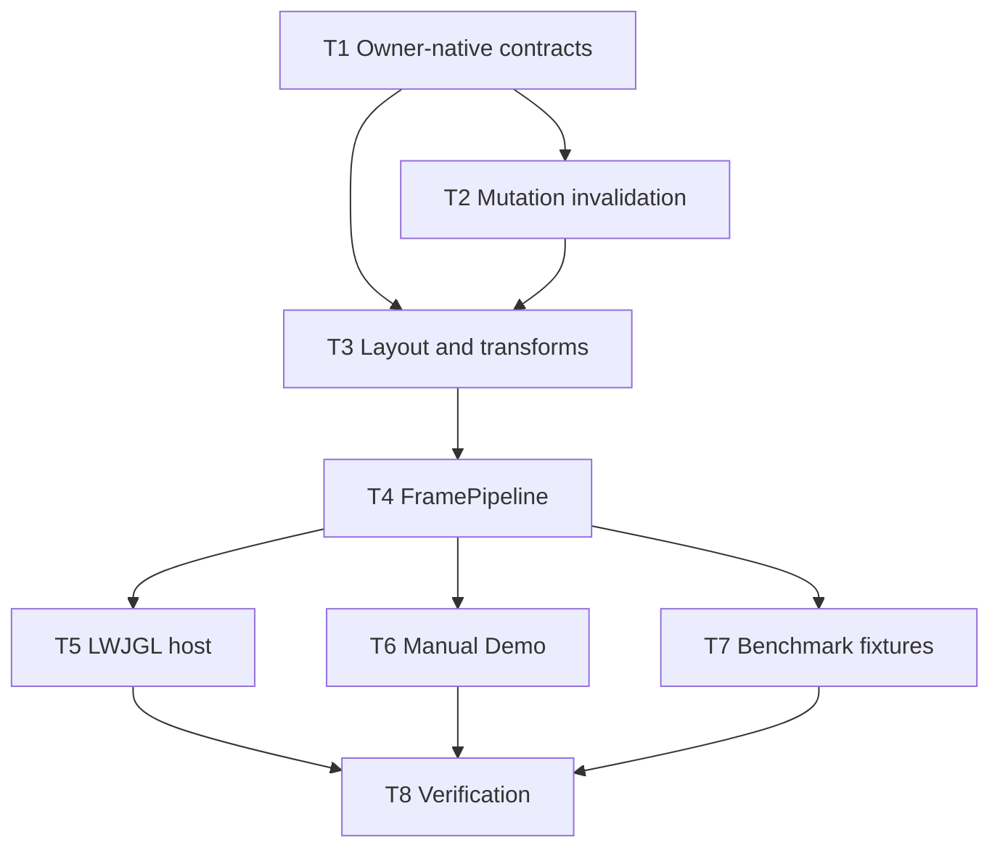

# E2/M2/P1: Refactor frame loop architecture

**Status:** Complete with verification caveat

## Outcome

The runtime has one owner-native contract per phase, reliable frame invalidation, a backend-independent `FramePipeline`, a reusable LWJGL host loop, a transparent manual demo, and benchmark fixtures that exercise the same preparation path.

## Scope boundaries

- Keep layout force-full; introduce only whole-stage decisions.
- Keep rendering outside `FramePipeline`.
- Keep `Frame` free of service references and host lifecycle ownership.
- Remove unstable compatibility APIs instead of maintaining parallel contracts.
- Preserve all unrelated dirty-worktree changes and avoid broad cleanup.

## Tasks

### T1: Consolidate owner-native phase contracts

**Status:** Complete

**Depends on:** None.

Replace event processor method families with one outcome-returning method. Move style, layout, and transition outcomes into their owning packages and return them from the existing service interfaces. Give renderer lifecycle one non-duplicated close contract. Adapt implementations and focused API tests, then remove superseded `WholeFrame*` adapters.

**Acceptance:**

- Each phase has one public execution method and one owner-native result where useful.
- Core style/layout/event/transition implementations no longer import `com.spinyowl.spinygui.core.frame`.
- No compatibility method delegates to a second method solely to preserve the experimental API.

### T2: Make source mutation invalidation reliable

**Status:** Complete

**Depends on:** T1.

Add explicit dirty state and a monotonic source revision to `Frame`. Route source mutations through notification-aware APIs for tree attachment, attributes/inline style, text/control values, hover/focus/pressed state, scrolling, stylesheets, and frame size. Stop returning mutable source aliases that bypass notification. Keep resolved-style/layout/presentation writes classified as stage-owned output.

**Acceptance:**

- Focused tests prove each supported source mutation increments revision and marks the minimum safe downstream work.
- Read access cannot mutate frame size, stylesheets, or source attribute/style collections behind `Frame`'s back.
- Repeating an equivalent setter value does not create a new revision unless semantics require it.

### T3: Separate layout and transform outcomes

**Status:** Complete

**Depends on:** T1, T2.

Return a truthful convergence result from force-full layout and expose transform resolution as a distinct `LayoutService` operation. Preserve scrollbar convergence and full layout membership rebuilding. Connect invalidation clear/propagation rules without introducing partial layout.

**Acceptance:**

- Layout reports converged, unconverged, or failed state without an adapter service.
- Transform-only preparation does not run full layout.
- Existing layout invariants and focused transform tests pass.

### T4: Implement backend-independent FramePipeline

**Status:** Complete

**Depends on:** T1, T2, T3.

Add an injected `FramePipeline` in the exported core API. Provide separate input processing and frame preparation boundaries so host update remains between them. Aggregate phase outcomes, enforce style -> transition -> layout/transform order, reject reentrant or cross-thread use, and prevent superseded or unconverged preparation from being considered renderable. Delete the experimental `core.frame` subsystem and migrate its valuable tests.

**Acceptance:**

- Fake-service tests prove the input/host-update/preparation boundary and exact internal ordering.
- No core pipeline class imports backend or renderer APIs.
- Failure, non-convergence, reentrancy, and source-revision supersession are explicit tested outcomes.
- `com.spinyowl.spinygui.core.frame` no longer exists.

### T5: Add a reusable LWJGL application loop

**Status:** Complete

**Depends on:** T4.

Add an abstract reusable application host in the existing LWJGL backend module. Inject the frame, pipeline, renderer, window/event operations, and clock/configuration rather than constructing concrete services internally. Keep `run()` final and expose only narrow initialization, update, before-render, after-render, and teardown hooks.

**Acceptance:**

- A deterministic host test proves `poll -> input -> update -> size sync -> prepare -> render -> swap`.
- Preparation failure prevents render and swap for that frame and reaches the host error boundary.
- Renderer and window resources close exactly once in reverse ownership order.

### T6: Preserve and correct the manual Demo loop

**Status:** Complete

**Depends on:** T4.

Keep `Demo` manually assembling services and stages. Reorder the loop to the canonical lifecycle, use owner-native results directly, synchronize dimensions before preparation, and stop swallowing layout/render failures with `printStackTrace()` followed by continued presentation.

**Acceptance:**

- The complex demo remains a manual low-level example and does not extend the reusable application base.
- Its source order is poll, input, update, size sync, style, transition, layout/transform, render, swap.
- The demo module compiles against the consolidated APIs.

### T7: Migrate benchmark fixtures to the real pipeline

**Status:** Complete

**Depends on:** T4.

Replace `WholeFrameSession` and direct style/layout preparation in benchmark fixtures with injected `FramePipeline`. Keep renderer traversal timing outside the core pipeline and preserve fixture identity/metadata needed for paired comparisons.

**Acceptance:**

- Benchmark production sources have no `core.frame` imports.
- Diagnostic interaction and frame baseline fixtures prepare frames through `FramePipeline`.
- Fixture tests cover idle, input/style, transition, layout, transform, and failure paths using production outcomes.

### T8: Verify and close the refactor

**Status:** Complete with verification caveat

**Depends on:** T5, T6, T7.

Run focused tests, affected module suites, the full Gradle build, the diagnostics baseline when available, and `benchmarkReport`. Review the final diff for accidental overlap with unrelated worktree changes and update E2 status with exact evidence and remaining native/manual gaps.

**Acceptance:**

- `git diff --check` passes for touched files.
- Affected tests and the full build pass, or an environmental blocker is recorded with exact command and output.
- A fresh benchmark artifact is identified by path and timestamp; comparisons use compatible fixture/configuration identities.
- E2 status distinguishes automated verification from any unperformed native visual check.

## Verification evidence

- `:spinygui.core:test`, `:spinygui.core.backend.lwjgl.nanovg:test`,
  `:spinygui.benchmark:test`, and `:spinygui.demo.complex:compileJava` passed in one
  sequential run on 2026-08-22. The final reports contain 669 core, 117 backend, and
  122 benchmark tests with zero failures, errors, or skips.
- `:spinygui.benchmark:diagnosticsInteractionBaseline` produced
  `spinygui.benchmark/reports/diagnostics-interaction-20260822-153127-714347500.json`.
  The stationary scenario records zero layout passes, zero transform compositions,
  and zero renderer node visits; invalidating scenarios exercise the production
  `FramePipeline` path.
- `:spinygui.benchmark:benchmarkReport` passed in 1m 57s and refreshed
  `spinygui.benchmark/reports/index.html`, `report-manifest.json`,
  `text-calculation-20260822-153352-065205700.json`, and
  `nanovg-text-20260822-153352-065205700.json`.
- `git diff --check` found no whitespace errors. Its output contained only the
  checkout's existing LF-to-CRLF conversion warnings.
- A full `build` reached Demo test compilation and PMD but could not write into or
  clean `spinygui.demo.complex/build`; Windows reported access denied/open handles
  for the generated directory. The affected source module still passed
  `:spinygui.demo.complex:compileJava`, and all three affected test suites passed
  independently. No potentially user-owned Java process was terminated.
- The native Demo window was not launched, so visual/native lifecycle acceptance
  remains a manual follow-up rather than automated evidence.

## Dependency graph



## Planned verification commands

```powershell
.\gradlew.bat --no-daemon :spinygui.core:test --console=plain
.\gradlew.bat --no-daemon :spinygui.core.backend.lwjgl.nanovg:test --console=plain
.\gradlew.bat --no-daemon :spinygui.demo.complex:compileJava --console=plain
.\gradlew.bat --no-daemon :spinygui.benchmark:test --console=plain
.\gradlew.bat --no-daemon :spinygui.benchmark:diagnosticsInteractionBaseline --console=plain
.\gradlew.bat --no-daemon :spinygui.benchmark:benchmarkReport --console=plain
.\gradlew.bat --no-daemon build --console=plain
```
