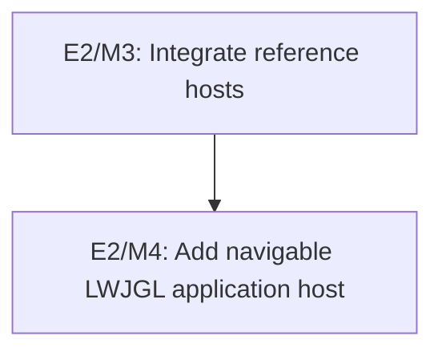

# E2/M4: Add Navigable LWJGL Application Host

## Document Context

- Status: Complete with verification caveat
- Dependencies: E2/M3
- Parent: [E2 - Frame runtime integration](../E2%20-%20Frame%20runtime%20integration.md)
- Children: [P1 - Compose navigation and top-layer host](M4/P1%20-%20Compose%20navigation%20and%20top-layer%20host.md)
- Related: [LWJGL application host navigation and top layer](../../design/lwjgl-application-host-navigation-and-top-layer.md)
- Next: [P1 - Compose navigation and top-layer host](M4/P1%20-%20Compose%20navigation%20and%20top-layer%20host.md)

## Goal

Extend the optional E2 LWJGL host with browser-like frame navigation, an element-based modal top
layer, reusable standard listener composition, and cbchain-aware GLFW event delivery while
preserving the existing single-frame and manual integration paths.

## Context

- E2/M3 completed the single-frame `AbstractLwjglApplication`, `NvgLwjglApplication`,
  `LwjglFrameServices`, and `DefaultLwjglWindow` boundary.
- The current concrete window maps events directly to one frame and replaces GLFW callbacks.
- The `spinygui` facade module already has the dependency direction required for a cbchain-aware
  high-level host.
- The approved design distinguishes exclusive frame navigation from modal elements in a frame-owned
  top layer.

## Architectural Proposition

Add a compositional `LwjglApplicationHost` in the existing facade module. It uses a
`FrameNavigator`, a frame-owned `TopLayer`, a `GlfwSystemEventBridge`, and reusable
`DefaultSystemEventListeners`; it does not make the runtime mandatory or move host ownership into
`FramePipeline`.

## Plan

[P1 - Compose navigation and top-layer host](M4/P1%20-%20Compose%20navigation%20and%20top-layer%20host.md)

## Key Work

- Add the navigation and modal contracts with explicit rendering, input, focus, and invalidation
  semantics.
- Extract standard listener composition without duplicating listener configuration.
- Separate GLFW event mapping and callback-chain ownership from standalone window lifecycle.
- Inject a narrow LWJGL-backend callback installer that the facade bridge can implement without a
  backend-to-facade dependency.
- Compose the current frame, pipeline, renderer, and window through the high-level host.
- Preserve single-frame constructors and document standalone versus embedded adoption.

## Validation

- Automated navigation, top-layer, callback ownership, and host lifecycle suites pass.
- Existing core, LWJGL/NanoVG, facade, simple-demo, and complex-demo gates remain green.
- A native smoke check is recorded separately and is not inferred from headless tests.

## Risks

- Modal handling can leak input or focus into background content if implemented per listener rather
  than at the shared hit-testing/focus boundary.
- Direct callback cleanup can free callbacks owned by another host unless bridge ownership is
  explicit.
- Generalizing the host for speculative renderer or overlay use cases would expand the API beyond
  the approved requirement.

## Dependency Graph

