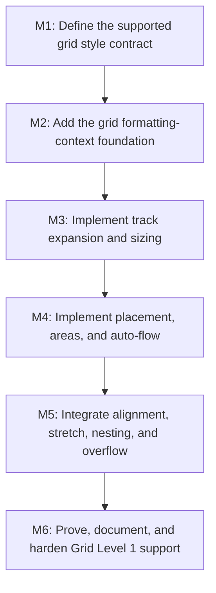

# E3 - CSS Grid support

**Status:** In progress

## Goal

Deliver a first-class CSS Grid Level 1 formatting context for SpinyGUI. A grid container must
resolve typed grid styles, size explicit and implicit tracks, place items deterministically, and
preserve the existing layout, overflow, rendering, and hit-testing contracts.

## Non-Goals

- CSS Grid Level 2 features: `subgrid`, masonry, and browser extensions.
- Replacing the existing parser, layout tree, renderer, or event system.
- Browser-perfect support for invalid CSS beyond explicitly documented fallback or rejection rules.

## Context

- `display: grid` resolves through the normal property pipeline and dispatches to `GridLayout`.
- `GridPropertyProvider` converts the supported grammar into typed grid values. Unsupported and
  edge-case grammar still needs broader rejection and compatibility coverage.
- `FlexLayout`, `BlockLayout`, `LayoutServiceImpl`, and the existing overflow and nested-layout
  paths define the compatibility boundary for a new layout mode.
- [Display Grid Implementation Plan](../features/display-grid-implementation-plan.md) is the
  source research document; this epic is the execution graph.

## Verified Implementation Boundary

The current checkout already contains and tests a substantial Grid Level 1 subset:

- typed track, placement, template-area, gap, and auto-flow values with shorthand expansion;
- dedicated `GridLayout` dispatch with fixed, percentage, `fr`, `minmax`, `fit-content`, and
  repeated tracks;
- explicit placement, named template areas, row/column auto-flow, dense packing, implicit tracks,
  item alignment/stretch, nested grid reflow, and grid overflow metrics;
- complex-demo coverage using real grid CSS; and
- focused style/layout tests covering parser resolution, fixed tracks, placement, areas, flexible
  sizing, overflow, positioned containers, and nested grids.

This is an implemented subset, not complete Grid Level 1 support. Remaining evidence and behavior
boundaries include container-level `justify-content`/`align-content`, full intrinsic-sizing
convergence, named-line and `span <name>` semantics, broader invalid-grammar coverage, control/text
interaction regressions, renderer/manual proof, and final support-matrix reconciliation.

## Assumptions and Open Questions

- Assumption: “Full support” means the CSS Grid Level 1 subset below, not Level 2.
- Assumption: percentage track sizing follows the project’s current containing-block and
  border-box conventions, which must be captured in tests before broadening support.
- Question: intrinsic text/item contribution may expose limitations in the current child layout
  pass. M4 must decide whether a bounded second pass is sufficient before M5 starts.

## Milestones

### M1: Define the supported grid style contract

**Document:** [M1 - Grid style contract](E3/M1%20-%20Grid%20style%20contract.md)

**Purpose:** Replace permissive raw-term acceptance with a precise, typed, testable CSS Grid
Level 1 subset that layout can consume.

**Depends on:** None.
**Enables:** M2.
**Parallelizable with:** None.

**Architectural Proposition:** Preserve parser terms only at the CSS boundary. Convert accepted
grid declarations into typed, immutable style values and reject unsupported grammar rather than
silently treating it as supported.

**Key Work:**

- Define typed track, placement, named-line, template-area, gap, and auto-flow values.
- Normalize supported longhands and shorthands into a single resolved style contract.
- Bound supported grammar: fixed/percentage/`fr`/`auto` tracks, `repeat`, `minmax`,
  `fit-content`, numeric/named lines, spans, template areas, and row/column dense auto-flow.
- Specify defaults, invalid declaration handling, and supported shorthand precedence.

**Open Questions:**

- Whether named-line repetition and `span <name>` can be fully represented without a larger CSS
  value-model change.

**Status:** Implemented subset.

**Validation:**

- Style tests prove equivalent longhand and shorthand declarations produce identical typed values.
- Invalid or unsupported declarations are rejected or documented as intentionally unsupported.

### M2: Add the grid formatting-context foundation

**Document:** [M2 - Grid formatting context](E3/M2%20-%20Grid%20formatting%20context.md)

**Purpose:** Introduce a dedicated `GridLayout` without regressing block layout, hidden-subtree,
absolute-positioned, layout-tree, or child-layout behavior.

**Depends on:** M1.
**Enables:** M3.
**Parallelizable with:** None.

**Architectural Proposition:** Reuse `BlockLayout` only for container-box establishment; let a
grid-specific layout component own item collection, cell geometry, and child-size assignment.

**Key Work:**

- Dispatch `Display.GRID` to `GridLayout` in `LayoutServiceProvider`.
- Define grid-item eligibility and exclude `display: none` and absolute-positioned descendants
  from normal placement.
- Establish explicit fixed-track geometry and row-major auto-placement as the minimal coherent
  formatting-context slice.
- Preserve layout child ordering and existing scroll/client-size accounting contracts.

**Open Questions:**

- Whether absolute descendants require a grid-area containing-block rule beyond current positioned
  ancestor behavior.

**Status:** Implemented.

**Validation:**

- Fixed-track grids produce expected border-box coordinates and sizes.
- Existing block, flex, inline, overflow, and positioned-child tests remain green.

### M3: Implement track expansion and sizing

**Document:** [M3 - Grid track sizing](E3/M3%20-%20Grid%20track%20sizing.md)

**Purpose:** Size explicit and implicit rows and columns according to the supported Grid Level 1
track model.

**Depends on:** M2.
**Enables:** M4.
**Parallelizable with:** None.

**Architectural Proposition:** Separate track expansion and sizing from item placement so sizing
rules can be tested as deterministic geometry independently of renderer behavior.

**Key Work:**

- Expand explicit templates, including `repeat` and named lines.
- Create implicit tracks from out-of-range placement and auto-placement pressure.
- Resolve fixed lengths, percentages, `auto`, `fr`, `minmax`, and `fit-content`; subtract gaps
  before distributing free space.
- Define intrinsic item contribution and the minimum viable child-measurement pass.

**Open Questions:**

- Whether `fit-content` and intrinsic contributions require new measurement APIs, or can be
  derived safely from the existing text and child layout data.

**Status:** Implemented subset.

**Validation:**

- Focused geometry tests cover each track kind, gaps, min/max constraints, and implicit tracks.
- Grid overflow contributes correct scroll dimensions.

### M4: Implement placement, areas, and auto-flow

**Document:** [M4 - Grid placement and auto-flow](E3/M4%20-%20Grid%20placement%20and%20auto-flow.md)

**Purpose:** Place items in explicit and implicit grid areas with CSS-order-stable behavior.

**Depends on:** M3.
**Enables:** M5.
**Parallelizable with:** None.

**Architectural Proposition:** Build a deterministic occupancy model shared by explicit placement,
template areas, and auto-placement; do not encode placement decisions into renderer traversal.

**Key Work:**

- Resolve line numbers, named lines, spans, `grid-row`, `grid-column`, and `grid-area`.
- Validate rectangular template areas and map named areas to line ranges.
- Implement row and column auto-flow, including dense backfilling.
- Define deterministic overlap and invalid-placement behavior.

**Open Questions:**

- How strictly to match browser behavior for named-line ambiguity and overlapping items; record
  any bounded deviations in tests and support documentation.

**Status:** Implemented subset.

**Validation:**

- Tests cover explicit placement, named areas, implicit extension, row/column flow, dense packing,
  and overlap ordering.

### M5: Integrate alignment, stretch, nesting, and overflow

**Document:** [M5 - Grid integration](E3/M5%20-%20Grid%20integration.md)

**Purpose:** Make the grid formatting context behave coherently with shared alignment and
interaction systems.

**Depends on:** M4.
**Enables:** M6.
**Parallelizable with:** None.

**Architectural Proposition:** Apply grid-specific alignment semantics in `GridLayout`, reusing
shared values only where their behavior is equivalent to flex; keep input/render geometry sourced
from final layout boxes.

**Key Work:**

- Implement content and item alignment, self alignment, place shorthands, and auto-size stretch.
- Re-run child layout after cell dimensions are final, including nested block, flex, and grid
  containers.
- Verify clipping, scrolling, hit-testing, text, buttons, inputs, and textareas within grid items.

**Open Questions:**

- Whether item baseline alignment belongs in this milestone or should be documented as a deferred
  Level 1 limitation if the current inline baseline model cannot support it safely.

**Status:** Implemented subset.

**Validation:**

- Nested and scrollable grid tests verify final geometry, interaction, and scroll metrics.
- Regression suites for flex, block, overflow, and inline formatting pass.

### M6: Prove, document, and harden Grid Level 1 support

**Document:** [M6 - Grid proof and documentation](E3/M6%20-%20Grid%20proof%20and%20documentation.md)

**Purpose:** Make the delivered compatibility contract observable and prevent regression.

**Depends on:** M5.
**Enables:** None.
**Parallelizable with:** None.

**Architectural Proposition:** The support matrix must be derived from executable tests and a real
demo, not parser registration alone.

**Key Work:**

- Add end-to-end layout, renderer, and interaction regressions for representative grids.
- Add a complex-demo grid example covering tracks, gaps, placement, areas, and nested content.
- Update the CSS support matrix with supported Grid Level 1 behavior and explicit deferrals.
- Record follow-up work for subgrid, masonry, unsupported intrinsic-sizing cases, and any deferred
  baseline alignment behavior.

**Open Questions:**

- None; unresolved compatibility decisions from M1–M5 must be documented before this milestone is
  complete.

**Status:** In progress.

**Validation:**

- Focused style/layout tests, affected layout regressions, backend tests, and demo compilation
  pass using the project JDK.
- Manual demo verification confirms geometry and pointer behavior match the documented subset.

## Cross-Cutting Risks

- Grid’s intrinsic sizing and item-layout feedback can require multiple measurement passes. Stop
  M3 and record a design decision if the current layout APIs cannot provide stable measurements.
- Parser support currently exceeds layout support. M1 must make unsupported grammar explicit before
  claiming compatibility.
- Alignment names overlap with flex but have different semantics. Keep implementation ownership in
  the grid formatting context.
- Grid affects geometry used by rendering, clipping, and hit-testing. Keep narrow layout tests
  ahead of renderer/demo expansion.

## Verification / Review Strategy

- Add focused `GridStyleManagerTest` and `GridLayoutTest` coverage as each milestone introduces a
  contract or algorithm.
- Run affected regression groups after M2–M5:
  `:spinygui.core:test --tests '*Grid*' --tests '*BlockLayoutTest' --tests '*FlexLayoutTest' --tests '*OverflowLayoutTest'`.
- Before M6 completion, run `:spinygui.core:test :spinygui.core.backend.lwjgl.nanovg:test
  :spinygui.demo.complex:classes` and manually verify the grid demo.

## Dependency Graph

