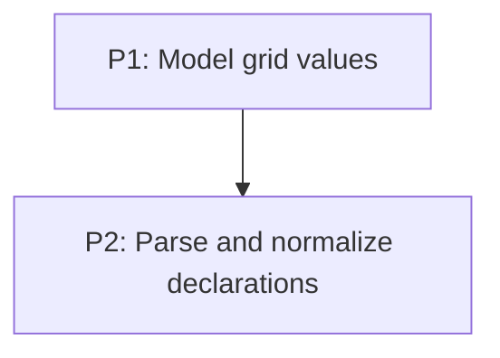

# M1: Grid style contract

## Goal

Replace raw grid CSS terms with a bounded, typed Grid Level 1 style contract that the layout
engine can consume without reparsing stylesheet syntax.

**Depends on:** None.
**Enables:** M2.
**Parallelizable with:** None.

## Context

- Parent epic: `docs/work/E3 - CSS Grid support.md`.
- `GridPropertyProvider` currently validates broad grammar and stores many values as raw terms.
- Typed values must be complete before `GridLayout` is introduced.

## Phases

### P1: Model grid values
**Document:** [P1 - Model grid values](M1/P1%20-%20Model%20grid%20values.md)
**Purpose:** Establish immutable values, defaults, and error boundaries for tracks, placement,
areas, gaps, and flow.

**Depends on:** None.
**Enables:** P2.
**Parallelizable with:** None.

### P2: Parse and normalize declarations
**Document:** [P2 - Parse and normalize declarations](M1/P2%20-%20Parse%20and%20normalize%20declarations.md)
**Purpose:** Convert supported CSS grammar and shorthands into the typed style contract.

**Depends on:** P1.
**Enables:** M2/P1.
**Parallelizable with:** None.

## Validation

- Equivalent supported longhand and shorthand CSS resolves to the same typed values.
- Unsupported grammar is rejected rather than exposed to layout as a raw term.

## Dependency Graph

