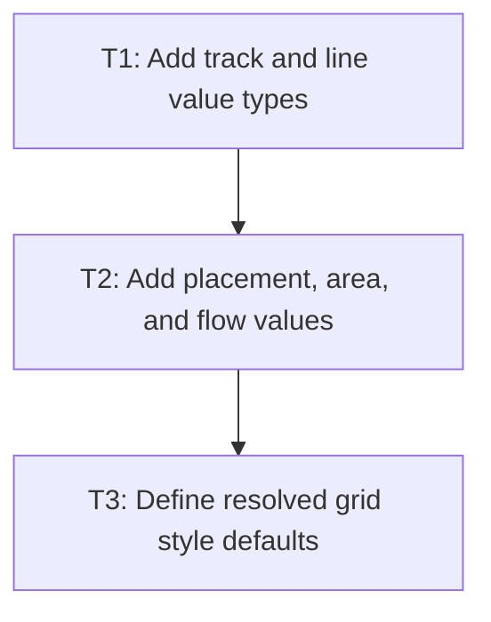

# P1: Model grid values

## Goal

Define the immutable Grid Level 1 value model and defaults required by style resolution and
layout, without changing layout dispatch.

## Non-Goals

- Parsing CSS declarations or wiring `Display.GRID` to a new layout.
- Level 2 grid features, subgrid, or masonry.

## Context

- Parent milestone: `docs/work/E3/M1 - Grid style contract.md`.
- Existing `GridFraction` is the only grid-specific value type; raw `Term` values must not leak
  into layout.

## Phase Tasks

### T1: Add track and line value types
**Purpose:** Give layout typed representations for track definitions and named lines.

**Depends on:** None.
**Enables:** T2.
**Parallelizable with:** None.

**Changes:**
- [ ] Add immutable types for fixed, percentage, flexible, auto, min/max, fit-content, and
  repeated track definitions under `style.types.grid`.
- [ ] Represent named lines and expanded track sequences without retaining parser terms.
- [ ] Add unit tests for value validation and equality.

**Acceptance Checks:**
- [ ] Invalid repeat counts, negative flexible factors, and invalid min/max bounds fail clearly.
- [ ] Value tests compile without layout or renderer dependencies.

**Risks:** A generic AST would duplicate CSS parsing; keep only layout-consumable values.

### T2: Add placement, area, and flow values
**Purpose:** Define typed item-placement and template-area contracts.

**Depends on:** T1.
**Enables:** T3.
**Parallelizable with:** None.

**Changes:**
- [ ] Add line-number, named-line, auto, and span placement values for each axis.
- [ ] Add typed template-area rows/ranges and auto-flow direction/dense state.
- [ ] Define deterministic overlap and invalid-area validation inputs for later placement work.

**Acceptance Checks:**
- [ ] Unit tests cover numeric, named, span, and auto placements.
- [ ] Template-area values preserve row ordering and reject ragged input.

**Risks:** Named-line ambiguity must remain explicit until M4 resolves it.

### T3: Define resolved grid style defaults
**Purpose:** Make an element with only `display: grid` expose stable typed defaults.

**Depends on:** T2.
**Enables:** P2/T1, M2/P1.
**Parallelizable with:** None.

**Changes:**
- [ ] Add `ResolvedStyle` accessors for the typed grid contract.
- [ ] Define initial templates, auto tracks, auto flow, placements, and zero gaps.
- [ ] Add style-accessor tests for root and inherited/non-inherited behavior.

**Acceptance Checks:**
- [ ] Accessors never return raw CSS terms or null for defined grid defaults.
- [ ] Existing non-grid style accessors remain unchanged.

**Risks:** None identified.

## Verification Strategy

- Run `./gradlew :spinygui.core:test --tests '*Grid*' --tests '*ResolvedStyle*'`.

## Dependency Graph

