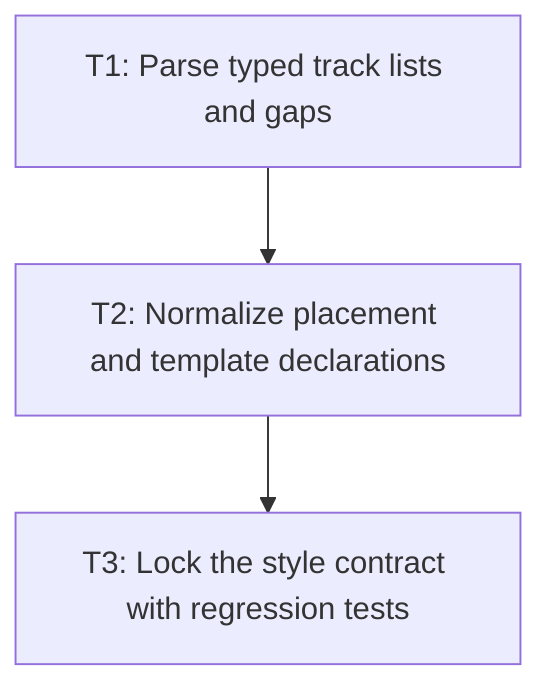

# P2: Parse and normalize declarations

## Goal

Map the supported Grid Level 1 CSS subset into the M1 typed values and normalize supported
shorthands into longhand resolved styles.

## Non-Goals

- Grid item geometry or track sizing.
- Accepting grammar that no later milestone can honor.

## Context

- Parent milestone: `docs/work/E3/M1 - Grid style contract.md`.
- `GridPropertyProvider` is the migration point from raw-term storage to typed values.

## Phase Tasks

### T1: Parse typed track lists and gaps
**Purpose:** Resolve template and auto-track declarations into typed definitions.

**Depends on:** M1/P1/T3.
**Enables:** T2.
**Parallelizable with:** None.

**Changes:**
- [ ] Convert supported track-list terms, `repeat`, `minmax`, and `fit-content` functions into
  typed values.
- [ ] Resolve row/column gaps and `gap` consistently as lengths.
- [ ] Reject nested or unsupported function forms with no style-map update.

**Acceptance Checks:**
- [ ] Parser tests cover fixed, percentage, `fr`, auto, repeat, minmax, fit-content, and gaps.
- [ ] Unsupported track syntax is not silently retained as a raw term.

**Risks:** Parser list grouping must preserve comma and space boundaries.

### T2: Normalize placement and template declarations
**Purpose:** Resolve item placement, areas, auto-flow, and template areas into typed longhands.

**Depends on:** T1.
**Enables:** T3.
**Parallelizable with:** None.

**Changes:**
- [ ] Parse grid row/column start/end, spans, area references, and auto-flow values.
- [ ] Expand `grid-row`, `grid-column`, `grid-area`, `grid-template`, and `grid` only for the
  supported grammar.
- [ ] Validate rectangular template areas and named references.

**Acceptance Checks:**
- [ ] Longhand and shorthand forms resolve equivalently in `ResolvedStyle`.
- [ ] Invalid slash, span, and template-area forms are rejected.

**Risks:** Keep unsupported shorthand combinations explicitly deferred.

### T3: Lock the style contract with regression tests
**Purpose:** Make the typed CSS boundary safe for later layout work.

**Depends on:** T2.
**Enables:** M2/P1.
**Parallelizable with:** None.

**Changes:**
- [ ] Add `GridStyleManagerTest` coverage for defaults, shorthand precedence, and invalid input.
- [ ] Update the support matrix to describe the implemented parsing contract, not layout support.

**Acceptance Checks:**
- [ ] Focused grid style tests pass.
- [ ] The support matrix continues to state that grid layout is not yet delivered.

**Risks:** Documentation must not claim formatting-context support prematurely.

## Verification Strategy

- Run `./gradlew :spinygui.core:test --tests '*GridStyleManagerTest'`.

## Dependency Graph

