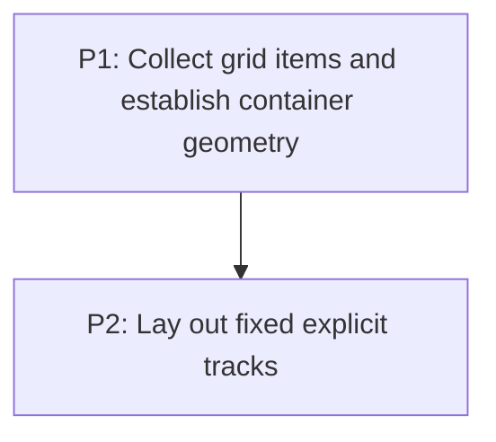

# M2: Grid formatting context

## Goal

Replace the current `Display.GRID -> BlockLayout` fallback with a dedicated grid formatting
context that has correct item eligibility and fixed-track geometry.

**Depends on:** M1.
**Enables:** M3.
**Parallelizable with:** None.

## Context

- Parent epic: `docs/work/E3 - CSS Grid support.md`.
- M1 provides typed styles; M2 must not reparse CSS.
- `FlexLayout` and `BlockLayout` are the implementation precedents.

## Phases

### P1: Collect grid items and establish container geometry
**Document:** [P1 - Collect grid items and establish container geometry](M2/P1%20-%20Collect%20grid%20items%20and%20establish%20container%20geometry.md)
**Purpose:** Define grid-item eligibility and the boundary between block container sizing and grid
child placement.

**Depends on:** M1/P2.
**Enables:** P2.
**Parallelizable with:** None.

### P2: Lay out fixed explicit tracks
**Document:** [P2 - Lay out fixed explicit tracks](M2/P2%20-%20Lay%20out%20fixed%20explicit%20tracks.md)
**Purpose:** Deliver a minimal coherent grid formatter with fixed tracks and row-major placement.

**Depends on:** P1.
**Enables:** M3/P1.
**Parallelizable with:** None.

## Validation

- Fixed-track grids create stable child boxes without regressing block/flex layout.

## Dependency Graph

