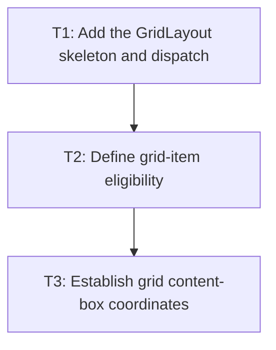

# P1: Collect grid items and establish container geometry

**Status:** Implemented

## Goal

Create the `GridLayout` boundary, reuse block container sizing, and identify normal-flow grid
items without changing placement semantics yet.

## Non-Goals

- Flexible or implicit tracks.
- Named placement or auto-flow beyond the fixed-track slice.

## Context

- Parent milestone: `docs/work/E3/M2 - Grid formatting context.md`.
- `LayoutServiceImpl` owns hidden cleanup, layout-child population, and scroll metrics.

## Phase Tasks

### T1: Add the GridLayout skeleton and dispatch
**Purpose:** Route `Display.GRID` through a dedicated layout component.

**Depends on:** M1/P2/T3.
**Enables:** T2.
**Parallelizable with:** None.

**Changes:**
- [ ] Add `GridLayout implements ElementLayout` and register it in `LayoutServiceProvider`.
- [ ] Delegate container border/padding/margin/available-size establishment to the established
  block-layout path.
- [ ] Add a dispatch regression proving `Display.GRID` no longer selects `BlockLayout` directly.

**Acceptance Checks:**
- [ ] A grid container keeps existing block box-sizing behavior.
- [ ] Non-grid display dispatch tests remain green.

**Risks:** Avoid recursive layout calls between `GridLayout` and `BlockLayout`.

### T2: Define grid-item eligibility
**Purpose:** Separate normal-flow grid items from excluded descendants.

**Depends on:** T1.
**Enables:** T3.
**Parallelizable with:** None.

**Changes:**
- [ ] Collect direct eligible child elements in document order.
- [ ] Exclude `display:none` and absolute-positioned children from normal grid occupancy.
- [ ] Preserve excluded children’s current positioned/hidden processing.

**Acceptance Checks:**
- [ ] Tests show hidden and absolute children do not consume a grid item slot.
- [ ] Layout child traversal remains deterministic.

**Risks:** Absolute descendants must retain their existing containing-block behavior.

### T3: Establish grid content-box coordinates
**Purpose:** Give later track sizing a stable coordinate system.

**Depends on:** T2.
**Enables:** M2/P2.
**Parallelizable with:** None.

**Changes:**
- [ ] Expose the grid content-box origin and available inline/block dimensions to grid logic.
- [ ] Add geometry tests for padding, borders, explicit width/height, and empty grids.

**Acceptance Checks:**
- [ ] Grid coordinates are relative to the content box, not the frame or border box.
- [ ] Empty grids preserve existing scroll and client-size behavior.

**Risks:** None identified.

## Verification Strategy

- Run `./gradlew :spinygui.core:test --tests '*GridLayoutTest' --tests '*BlockLayoutTest'`.

## Dependency Graph

