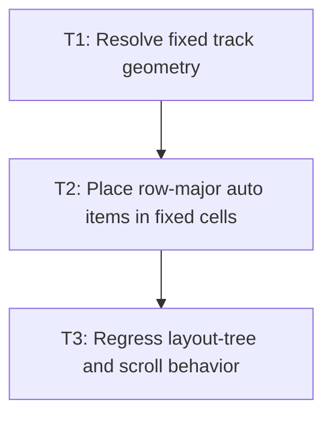

# P2: Lay out fixed explicit tracks

**Status:** Implemented

## Goal

Place eligible items into fixed explicit row and column tracks, proving the formatting-context
contract before flexible sizing or full placement is added.

## Non-Goals

- Implicit tracks, `fr`, intrinsic sizing, spans, named lines, or dense placement.

## Context

- Parent milestone: `docs/work/E3/M2 - Grid formatting context.md`.
- Use M1 typed track values and M2/P1 content-box/item collection.

## Phase Tasks

### T1: Resolve fixed track geometry
**Purpose:** Convert fixed explicit row and column definitions into ordered grid lines.

**Depends on:** M2/P1/T3.
**Enables:** T2.
**Parallelizable with:** None.

**Changes:**
- [ ] Resolve pixel and definite percentage tracks against the content box.
- [ ] Apply row and column gaps between tracks.
- [ ] Return immutable line positions for placement and testing.

**Acceptance Checks:**
- [ ] Fixed two-dimensional templates produce exact line coordinates.
- [ ] Gaps do not appear before the first or after the final explicit track.

**Risks:** Percentage behavior must match the documented containing-block convention.

### T2: Place row-major auto items in fixed cells
**Purpose:** Give ordinary children visible grid geometry.

**Depends on:** T1.
**Enables:** T3.
**Parallelizable with:** None.

**Changes:**
- [ ] Assign eligible items to row-major cells in document order.
- [ ] Set each item’s available box before invoking existing child layout.
- [ ] Stop with a clear unsupported outcome when fixed explicit capacity is exceeded.

**Acceptance Checks:**
- [ ] Four items in a two-by-two fixed grid receive expected positions and dimensions.
- [ ] Child content lays out within the assigned cell.

**Risks:** This bounded overflow behavior is replaced by implicit tracks in M3.

### T3: Regress layout-tree and scroll behavior
**Purpose:** Confirm fixed grids participate in the existing frame pipeline.

**Depends on:** T2.
**Enables:** M3/P1.
**Parallelizable with:** None.

**Changes:**
- [ ] Cover layout-child order, scroll metrics, clipping, and hit-test boxes for fixed grids.
- [ ] Run focused block/flex/overflow regressions.

**Acceptance Checks:**
- [ ] Fixed grid children render and receive pointer targeting at their grid boxes.
- [ ] No existing layout regression fails.

**Risks:** None identified.

## Verification Strategy

- Run `./gradlew :spinygui.core:test --tests '*GridLayoutTest' --tests '*OverflowLayoutTest'`.

## Dependency Graph

