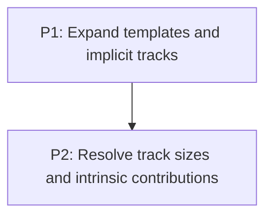

# M3: Grid track sizing

**Status:** Implemented subset

## Goal

Expand explicit and implicit tracks and resolve their Grid Level 1 sizes before full item
placement is introduced.

**Depends on:** M2.
**Enables:** M4.
**Parallelizable with:** None.

## Context

- Parent epic: `docs/work/E3 - CSS Grid support.md`.
- M2 has a dedicated formatter and fixed-track geometry.
- The current implementation covers the supported track kinds and implicit tracks; complete
  intrinsic contribution and convergence proof remains open.

## Phases

### P1: Expand templates and implicit tracks
**Document:** [P1 - Expand templates and implicit tracks](M3/P1%20-%20Expand%20templates%20and%20implicit%20tracks.md)
**Purpose:** Produce a complete ordered track model from templates and placement pressure.

**Depends on:** M2/P2.
**Enables:** P2.
**Parallelizable with:** None.

### P2: Resolve track sizes and intrinsic contributions
**Document:** [P2 - Resolve track sizes and intrinsic contributions](M3/P2%20-%20Resolve%20track%20sizes%20and%20intrinsic%20contributions.md)
**Purpose:** Implement supported Grid Level 1 sizing, including flexible and content-dependent
tracks.

**Depends on:** P1.
**Enables:** M4/P1.
**Parallelizable with:** None.

## Validation

- Each supported track type and implicit-track case has deterministic geometry coverage.

## Dependency Graph

