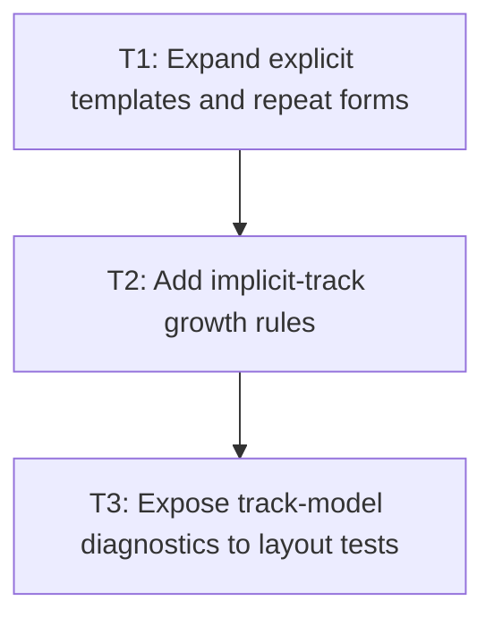

# P1: Expand templates and implicit tracks

**Status:** Implemented subset

## Goal

Turn typed explicit templates and placement demand into an ordered row/column track model with
line names and implicit-track placeholders.

## Non-Goals

- Calculating final `fr`, auto, minmax, or fit-content sizes.
- Full auto-placement behavior.

## Context

- Parent milestone: `docs/work/E3/M3 - Grid track sizing.md`.
- M1 typed `repeat` and named-line values are the only input; do not inspect parser terms.

## Phase Tasks

### T1: Expand explicit templates and repeat forms
**Purpose:** Produce concrete explicit tracks and line-name indexes.

**Depends on:** M2/P2/T3.
**Enables:** T2.
**Parallelizable with:** None.

**Changes:**
- [ ] Expand fixed-count `repeat(...)` forms and carry named lines to concrete line indices.
- [ ] Reject unresolved auto-repeat forms until they have an explicit sizing contract.
- [ ] Add pure-model tests for expansion and line indexes.

**Acceptance Checks:**
- [ ] Expanded tracks preserve source order and line-name multiplicity.
- [ ] Unsupported repeat forms fail at style validation or expansion with a clear error.

**Risks:** Named line repetition is consumed by M4 placement, so indexing must be immutable.

### T2: Add implicit-track growth rules
**Purpose:** Create rows/columns required beyond explicit template bounds.

**Depends on:** T1.
**Enables:** T3.
**Parallelizable with:** None.

**Changes:**
- [ ] Add typed implicit row/column creation using `grid-auto-rows` and `grid-auto-columns`.
- [ ] Support before/after explicit-grid growth required by resolved placement lines.
- [ ] Add tests for deterministic implicit indexes.

**Acceptance Checks:**
- [ ] Out-of-range placement demand produces correctly indexed implicit tracks.
- [ ] Implicit tracks retain their configured auto-track definition.

**Risks:** Final auto-placement demand is added in M4; keep this API placement-source agnostic.

### T3: Expose track-model diagnostics to layout tests
**Purpose:** Make track expansion failures observable without renderer inspection.

**Depends on:** T2.
**Enables:** M3/P2.
**Parallelizable with:** None.

**Changes:**
- [ ] Add focused model/layout test helpers for track index, source, and explicit/implicit state.
- [ ] Document the stop condition for unsupported auto-repeat grammar.

**Acceptance Checks:**
- [ ] Tests can assert expanded track count and source independently of final pixel sizing.
- [ ] No renderer module depends on the diagnostic API.

**Risks:** Keep diagnostics package-private or test-only.

## Verification Strategy

- Run `./gradlew :spinygui.core:test --tests '*Grid*Track*Test'`.

## Dependency Graph

