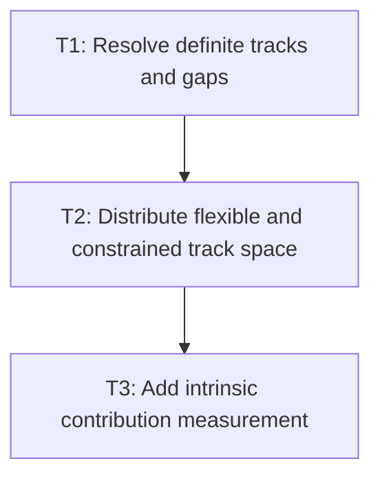

# P2: Resolve track sizes and intrinsic contributions

## Goal

Compute stable pixel geometry for supported grid tracks, including flexible and
content-constrained tracks, before placement uses those final lines.

## Non-Goals

- Named-area or dense auto-placement.
- Baseline alignment.

## Context

- Parent milestone: `docs/work/E3/M3 - Grid track sizing.md`.
- M3/P1 owns the expanded ordered track model.

## Phase Tasks

### T1: Resolve definite tracks and gaps
**Purpose:** Size fixed and percentage tracks in the grid content box.

**Depends on:** M3/P1/T3.
**Enables:** T2.
**Parallelizable with:** None.

**Changes:**
- [ ] Resolve fixed and percentage track bases and subtract inter-track gaps.
- [ ] Respect container definite size, padding, border, and min/max constraints.
- [ ] Add geometry tests for row and column axes.

**Acceptance Checks:**
- [ ] Sum of sized tracks plus gaps matches available definite space where applicable.
- [ ] Percentages use the documented content-box axis.

**Risks:** Indefinite container behavior must be explicit before flexible sizing.

### T2: Distribute flexible and constrained track space
**Purpose:** Implement `fr`, `minmax`, and `fit-content` sizing rules for the supported subset.

**Depends on:** T1.
**Enables:** T3.
**Parallelizable with:** None.

**Changes:**
- [ ] Distribute positive free space among flexible tracks by factor.
- [ ] Clamp minmax tracks and cap fit-content tracks.
- [ ] Define deterministic behavior for over-constrained grids.

**Acceptance Checks:**
- [ ] Tests cover mixed fixed/flexible tracks, clamp boundaries, and insufficient space.
- [ ] No track receives a negative final size.

**Risks:** Avoid browser-internal algorithm imitation where the supported subset is sufficient.

### T3: Add intrinsic contribution measurement
**Purpose:** Size auto/content-dependent tracks using stable child measurements.

**Depends on:** T2.
**Enables:** M4/P1.
**Parallelizable with:** None.

**Changes:**
- [ ] Define a bounded child-measurement pass for auto and content-constrained tracks.
- [ ] Re-layout children after final cell size assignment when needed.
- [ ] Add nested text/block/flex sizing regressions.

**Acceptance Checks:**
- [ ] Auto tracks grow for measured child content without unstable repeated layout.
- [ ] Stop and document a design decision if the existing layout API cannot converge in two passes.

**Risks:** This is the highest-risk grid milestone; do not proceed to M4 without stable results.

## Verification Strategy

- Run `./gradlew :spinygui.core:test --tests '*GridLayoutTest' --tests '*TextLayout*'`.

## Dependency Graph

