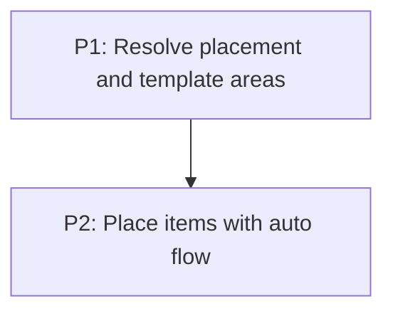

# M4: Grid placement and auto-flow

**Status:** Implemented subset

## Goal

Resolve explicit placement and template areas, then fill remaining cells with deterministic
Grid Level 1 auto-flow behavior.

**Depends on:** M3.
**Enables:** M5.
**Parallelizable with:** None.

## Context

- Parent epic: `docs/work/E3 - CSS Grid support.md`.
- M3 provides the supported track lines and bounded measurement behavior.

## Current Boundary

Numeric placement, supported spans, named template areas, row/column auto-flow, and dense
placement are implemented. Named-line ambiguity, `span <name>`, and overlapping-item edge cases
still require explicit compatibility decisions and proof.

## Phases

### P1: Resolve placement and template areas
**Document:** [P1 - Resolve placement and template areas](M4/P1%20-%20Resolve%20placement%20and%20template%20areas.md)
**Purpose:** Turn typed line, span, and area declarations into occupied ranges.

**Depends on:** M3/P2.
**Enables:** P2.
**Parallelizable with:** None.

### P2: Place items with auto flow
**Document:** [P2 - Place items with auto flow](M4/P2%20-%20Place%20items%20with%20auto%20flow.md)
**Purpose:** Implement row/column flow, implicit growth, dense packing, and overlap rules.

**Depends on:** P1.
**Enables:** M5/P1.
**Parallelizable with:** None.

## Validation

- Explicit ranges, named areas, auto placement, and dense backfilling produce tested occupancy.

## Dependency Graph

