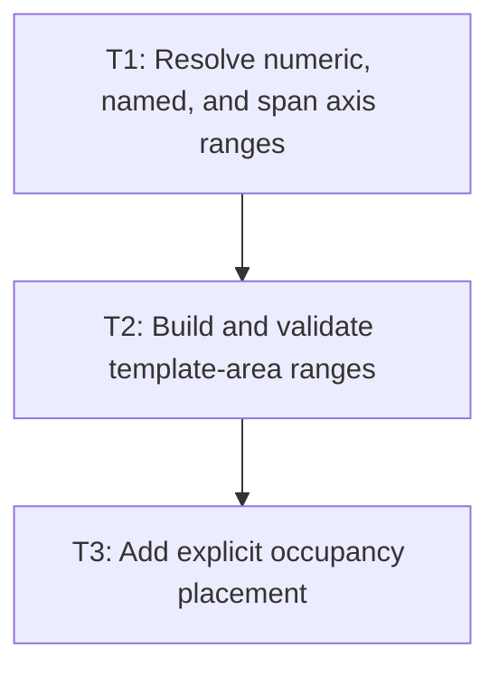

# P1: Resolve placement and template areas

**Status:** Implemented subset

## Goal

Resolve grid row/column declarations and named template areas into concrete grid ranges before
auto-placement fills any remaining slots.

## Non-Goals

- Row/column auto-flow scanning or dense packing.
- Baseline alignment.

## Context

- Parent milestone: `docs/work/E3/M4 - Grid placement and auto-flow.md`.
- M3 line indexes and track geometry are authoritative.

## Phase Tasks

### T1: Resolve numeric, named, and span axis ranges
**Purpose:** Convert each axis placement to a concrete start/end line range.

**Depends on:** M3/P2/T3.
**Enables:** T2.
**Parallelizable with:** None.

**Changes:**
- [ ] Resolve positive numeric lines, named lines, auto values, and span counts.
- [ ] Define failure behavior for missing names, invalid ranges, and unsupported named spans.
- [ ] Add axis-level placement tests independent of occupancy.

**Acceptance Checks:**
- [ ] Valid line and span combinations resolve to inclusive cell ranges.
- [ ] Invalid combinations do not corrupt implicit track state.

**Risks:** Document any deferred named-span behavior before accepting it.

### T2: Build and validate template-area ranges
**Purpose:** Make named areas a validated source of placement ranges.

**Depends on:** T1.
**Enables:** T3.
**Parallelizable with:** None.

**Changes:**
- [ ] Convert template-area rows into rectangular row/column ranges.
- [ ] Map `grid-area` names to area ranges and generated line names where supported.
- [ ] Add invalid rectangle and unknown-area tests.

**Acceptance Checks:**
- [ ] Rectangular named areas span the expected cells.
- [ ] Ragged/non-rectangular templates are rejected during style resolution.

**Risks:** Generated line-name behavior must match the stated supported subset.

### T3: Add explicit occupancy placement
**Purpose:** Reserve cells and assign final boxes for explicitly placed items.

**Depends on:** T2.
**Enables:** M4/P2.
**Parallelizable with:** None.

**Changes:**
- [ ] Build an occupancy model from explicit ranges in document order.
- [ ] Set item grid-area boxes from final track lines and invoke child layout.
- [ ] Define deterministic overlap ordering.

**Acceptance Checks:**
- [ ] Explicit and area-placed items occupy expected multi-cell boxes.
- [ ] Overlaps render and receive pointer targeting in documented tree order.

**Risks:** Keep occupancy model separate from renderer traversal.

## Verification Strategy

- Run `./gradlew :spinygui.core:test --tests '*Grid*Placement*Test'`.

## Dependency Graph

