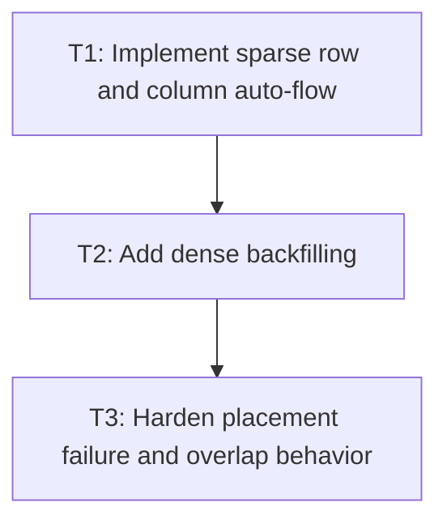

# P2: Place items with auto flow

**Status:** Implemented subset

## Goal

Fill unoccupied grid cells using row/column auto-flow, grow implicit tracks as required, and
support the documented dense-packing subset.

## Non-Goals

- Alignment and stretch.
- Browser-specific auto-placement quirks beyond the tested Level 1 subset.

## Context

- Parent milestone: `docs/work/E3/M4 - Grid placement and auto-flow.md`.
- M4/P1 owns explicit occupancy; this phase must not move explicit items.

## Phase Tasks

### T1: Implement sparse row and column auto-flow
**Purpose:** Place auto-positioned items in CSS order after explicit occupancy.

**Depends on:** M4/P1/T3.
**Enables:** T2.
**Parallelizable with:** None.

**Changes:**
- [ ] Scan free cells in row and column flow order.
- [ ] Honor one-axis definite placement while resolving the other automatically.
- [ ] Grow implicit tracks through the M3 track-model API.

**Acceptance Checks:**
- [ ] Auto items fill expected cells after explicit items.
- [ ] Row and column flow produce different, tested orderings.

**Risks:** Keep cursor state local to one layout pass.

### T2: Add dense backfilling
**Purpose:** Revisit earlier holes for `row dense` and `column dense` without moving explicit items.

**Depends on:** T1.
**Enables:** T3.
**Parallelizable with:** None.

**Changes:**
- [ ] Add dense scan reset behavior to the occupancy algorithm.
- [ ] Test backfilling with spans and mixed explicit/auto items.

**Acceptance Checks:**
- [ ] Dense mode fills an earlier compatible hole that sparse mode leaves empty.
- [ ] Explicitly positioned items retain their ranges.

**Risks:** Span placement must not cause unbounded scan loops.

### T3: Harden placement failure and overlap behavior
**Purpose:** Make unusual placement states deterministic and diagnosable.

**Depends on:** T2.
**Enables:** M5/P1.
**Parallelizable with:** None.

**Changes:**
- [ ] Cover oversized spans, exhausted explicit bounds, overlap, and implicit growth limits.
- [ ] Document intentional fallback/rejection behavior in tests and support docs.

**Acceptance Checks:**
- [ ] No invalid placement can leave a partially mutated occupancy model.
- [ ] Focused placement tests pass with deterministic results.

**Risks:** None identified.

## Verification Strategy

- Run `./gradlew :spinygui.core:test --tests '*Grid*Placement*Test' --tests '*GridLayoutTest'`.

## Dependency Graph

