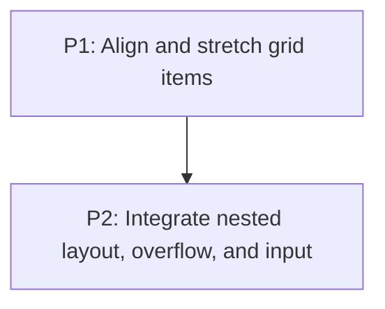

# M5: Grid integration

**Status:** Implemented subset

## Goal

Integrate final grid boxes with item alignment, stretch, nested child layout, scrolling, clipping,
and input geometry.

**Depends on:** M4.
**Enables:** M6.
**Parallelizable with:** None.

## Context

- Parent epic: `docs/work/E3 - CSS Grid support.md`.
- M4 produces final item areas and occupancy.
- Existing renderer and input paths consume final layout boxes; M5 must preserve that boundary.

## Current Boundary

Item alignment/stretch, nested-grid reflow, and overflow metrics are implemented. Container-level
`justify-content`/`align-content` and broader control/text interaction proof remain open.

## Phases

### P1: Align and stretch grid items
**Document:** [P1 - Align and stretch grid items](M5/P1%20-%20Align%20and%20stretch%20grid%20items.md)
**Purpose:** Apply content, item, and self alignment using grid-specific semantics.

**Depends on:** M4/P2.
**Enables:** P2.
**Parallelizable with:** None.

### P2: Integrate nested layout, overflow, and input
**Document:** [P2 - Integrate nested layout, overflow, and input](M5/P2%20-%20Integrate%20nested%20layout%20overflow%20and%20input.md)
**Purpose:** Re-layout children in final cells and prove clipping, scroll, and interaction behavior.

**Depends on:** P1.
**Enables:** M6/P1.
**Parallelizable with:** None.

## Validation

- Nested/scrollable grid content has stable geometry and usable input targeting.

## Dependency Graph

