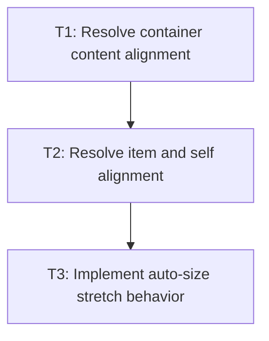

# P1: Align and stretch grid items

## Goal

Apply supported Grid Level 1 alignment and stretch semantics to already placed item areas.

## Non-Goals

- Baseline alignment unless the existing inline baseline model proves sufficient.
- Replacing flex alignment behavior.

## Context

- Parent milestone: `docs/work/E3/M5 - Grid integration.md`.
- M4 owns item areas; this phase adjusts final item boxes within those areas.

## Phase Tasks

### T1: Resolve container content alignment
**Purpose:** Position the whole grid track area when the container has free space.

**Depends on:** M4/P2/T3.
**Enables:** T2.
**Parallelizable with:** None.

**Changes:**
- [ ] Apply supported `justify-content` and `align-content` modes to final track lines.
- [ ] Keep gap distribution and content-box coordinates explicit.
- [ ] Add free-space alignment geometry tests.

**Acceptance Checks:**
- [ ] Center/end/space distribution behavior is deterministic for both axes.
- [ ] Alignment does not alter track sizes or occupancy.

**Risks:** Shared enum names must not imply flex implementation reuse.

### T2: Resolve item and self alignment
**Purpose:** Position non-stretched items inside their assigned areas.

**Depends on:** T1.
**Enables:** T3.
**Parallelizable with:** None.

**Changes:**
- [ ] Apply `justify-items`, `align-items`, `justify-self`, `align-self`, and supported place
  shorthands with documented precedence.
- [ ] Add item-area offset tests for each supported axis mode.

**Acceptance Checks:**
- [ ] Self alignment overrides container item alignment.
- [ ] Auto values use the documented default behavior.

**Risks:** Baseline values must be deferred if not safely measurable.

### T3: Implement auto-size stretch behavior
**Purpose:** Fill grid areas for stretch-eligible items without overriding explicit item sizes.

**Depends on:** T2.
**Enables:** M5/P2.
**Parallelizable with:** None.

**Changes:**
- [ ] Identify stretch-eligible auto-sized dimensions.
- [ ] Assign stretched available boxes and re-layout child content.
- [ ] Add fixed-size and auto-size contrast tests.

**Acceptance Checks:**
- [ ] Explicit width/height prevent stretch on that axis.
- [ ] Stretched controls and text keep valid paint and input boxes.

**Risks:** Avoid forcing stretch through min/max constraints.

## Verification Strategy

- Run `./gradlew :spinygui.core:test --tests '*Grid*Alignment*Test' --tests '*GridLayoutTest'`.

## Dependency Graph

